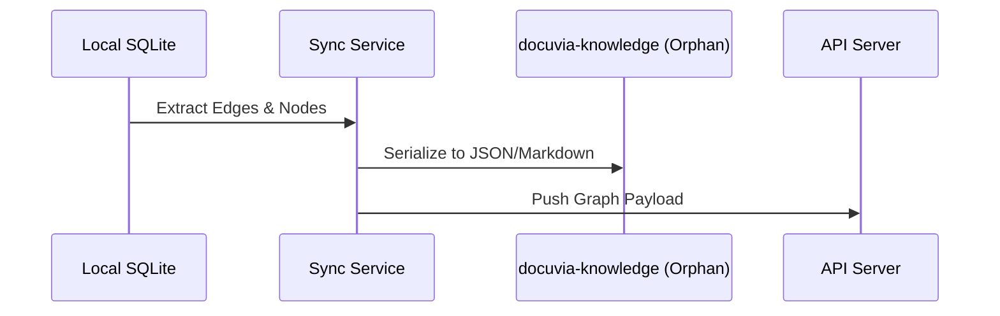

# Orphan Branch R/W Protocol

- **Status**: ⚠️ WARN
- **Phase**: Phase 4: Git-Isomorphic Sync & Temporal Knowledge
- **Evidence / Verification Target**: `lib/core/src/services/orphan-branch-writer.ts`

## Implementation Details

Only the **Write** half of "R/W" exists. `orphan-branch-writer.ts` (152 lines) correctly serializes L1/L2/L3 nodes to YAML/Markdown via `git fast-import`, guarded by a Postgres advisory lock against split-brain writes. There is no **Read**/hydrate counterpart anywhere in `lib/core/src` — only `init-service.ts` (branch creation) and `orphan-branch-writer.ts` (write) reference the `docuvia-knowledge` branch at all. Reading historical snapshots back from the orphan branch is not implemented yet (this overlaps with the hydrate path also called out as missing in [Tiered Storage & Tombstone GC](tiered-storage-tombstone-gc.md)).

Core component:

[`lib/core/src/services/orphan-branch-writer.ts`](../../../../lib/core/src/services/orphan-branch-writer.ts)

### Architecture Flow

### Component Description

- **Core Logic**: Handled primarily within the target files linked above.
- **State Management**: Persists or queries state directly via the defined interfaces.

## Testing & Verification

- Run `pnpm test` in the relevant workspace.
- Validate the behavior locally using `docuvia` CLI or the VS Code Extension.
- Check the [Regression & Parity Testing](../../guidelines/regression-and-parity-testing.md) guidelines.
