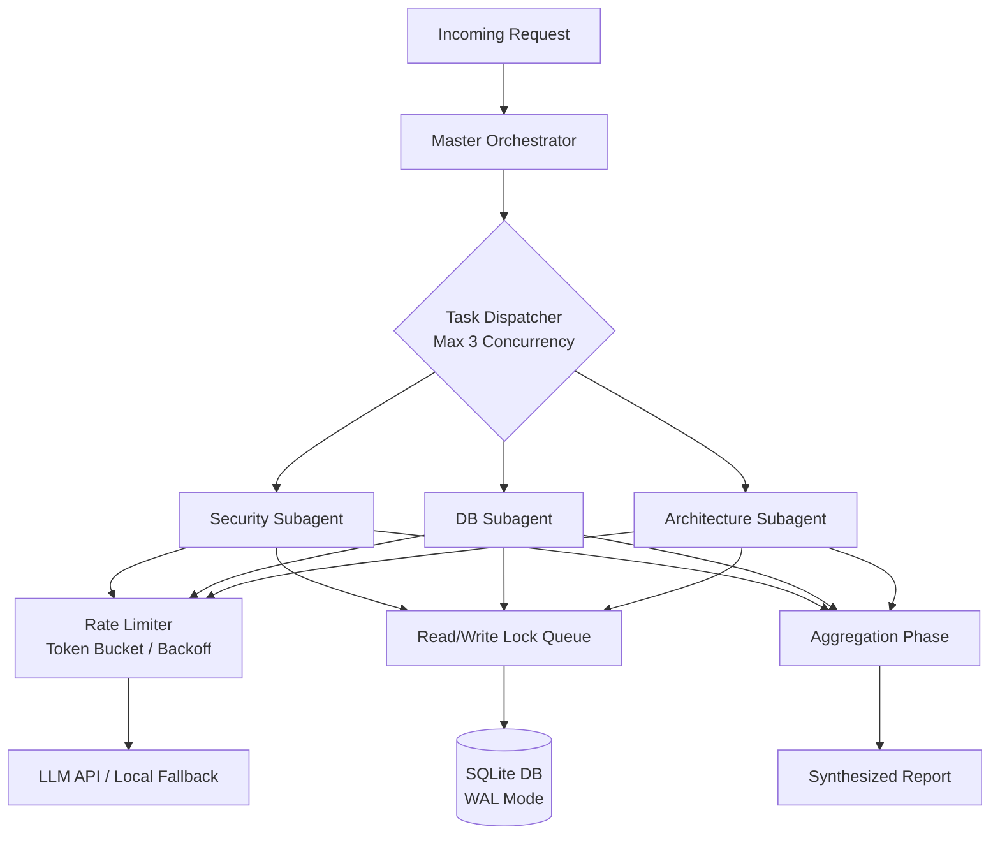

# Parallel Swarm Review Concepts

- **Status**: ⚠️ WARN
- **Phase**: Phase 6: Architecture Hardening & Security
- **Evidence / Verification Target**: `lib/core/src/services/swarm/task-dispatcher.ts`, `lib/core/src/services/swarm/llm-rate-limiter.ts`, `lib/core/src/services/swarm/swarm-orchestrator.service.ts`, `lib/core/src/utils/read-write-lock.ts`
- **ADR**: [ADR-032](../../adr/ADR-032-parallel-swarm-review-and-background-rag.md)

## Implementation Details

Despite the "Concepts" name and "Planned" evidence framing, this is substantially built, not just conceptual — every component in the diagram below exists in `lib/core/src/services/swarm/`, each explicitly commented "(ADR-032)" and covered by unit tests:

- `task-dispatcher.ts`: hard-caps concurrency at `MAX_PARALLEL_AGENTS = 3` via `p-limit`.
- `llm-rate-limiter.ts`: token-bucket + exponential backoff.
- `swarm-orchestrator.service.ts`: dispatch + aggregation.
- `lib/core/src/utils/read-write-lock.ts`: FIFO read/write lock queue (mitigates SQLite `database is locked`).

**Not implemented**: the "local model fallback when LLM rate limits are exhausted" sub-claim — retries currently just reuse the same LLM call, they don't route to a local model.

### Architecture Flow

### Component Description

- **SQLite WAL & Read/Write Lock Queue**: Enables concurrent reads and queues writes and heavy vector queries, preventing `SQLITE_BUSY` (database is locked).
- **Task Dispatcher**: Limits active parallel subagents to a strict concurrency bound (e.g., max 3 active parallel agents) mapped to local hardware capacity.
- **Rate Limiter & Fallback**: Manages token buckets, exponential backoff, and routes non-critical swarm agents to local models when LLM provider rate limits are exhausted.
- **Master Orchestrator & Aggregation Phase**: Handles parallel dispatching and subsequent synthesis of parallel findings into a final cohesive output.

## Testing & Verification

- Run `pnpm test` in the relevant workspace.
- Validate the behavior locally using `docuvia` CLI or the VS Code Extension.
- Check the [Regression & Parity Testing](../../guidelines/regression-and-parity-testing.md) guidelines.
