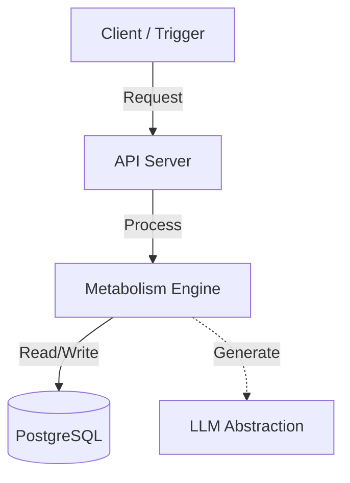

# Per-project model switching

- **Status**: ⚠️ WARN
- **Phase**: Phase 1: Core API & Database (The Metabolism Engine)
- **Evidence / Verification Target**: `lib/db/src/schema/pg/llm-configs.ts` + `lib/core/src/services/llm-provider.ts`
- **ADR**: [ADR-026](../../adr/ADR-026-multi-provider-llm-abstraction.md)

## Implementation Details

This feature is anchored by the following core components:

[`lib/db/src/schema/pg/llm-configs.ts`](../../../../lib/db/src/schema/pg/llm-configs.ts) + [`lib/core/src/services/llm-provider.ts`](../../../../lib/core/src/services/llm-provider.ts)

### Architecture Flow

### Component Description

- **Core Logic**: Handled primarily within the target files linked above.
- **State Management**: Persists or queries state directly via the defined interfaces.

## Testing & Verification

- Run `pnpm test` in the relevant workspace.
- Validate the behavior locally using `docuvia` CLI or the VS Code Extension.
- Check the [Regression & Parity Testing](../../guidelines/regression-and-parity-testing.md) guidelines.
