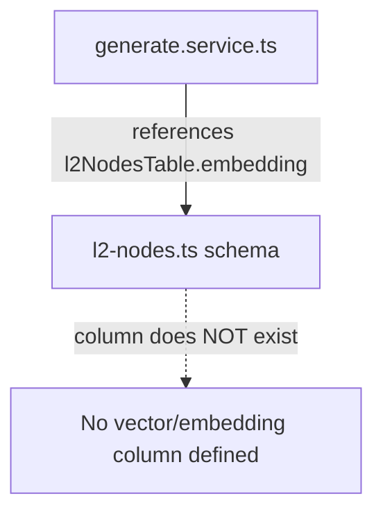

# pgvector Migration

- **Status**: ⚠️ WARN
- **Phase**: Phase 6: Architecture Hardening & Security
- **Evidence / Verification Target**: `lib/db/src/schema/pg/l2-nodes.ts`
- **ADR**: [ADR-019](../../adr/ADR-019-pgvector-migration.md)

## Implementation Details

**Gap is deeper than WARN suggests.** `l2-nodes.ts` and `l3-nodes.ts` import `vector` from `drizzle-orm/pg-core` but never use it — neither table actually defines an `embedding`/`vector(1536)` column, contradicting ADR-019's decision text ("Modify l2_nodesTable and l3_nodesTable ... to use vector(1536) for the embedding column"). Meanwhile `lib/core/src/services/generation/generate.service.ts` and `noise-detection-service.ts` already reference `l2NodesTable.embedding` / `node.embedding` in code — i.e. application code assumes a column that does not exist in the schema. This should be treated as a live bug risk (undefined-column reference), not just an incomplete migration, and verified before other pgvector-dependent features (vector-index-search, semantic-search) are trusted.

### Architecture Flow

### Component Description

- **Core Logic**: `l2-nodes.ts`/`l3-nodes.ts` import `vector` but don't declare an embedding column; `generate.service.ts`/`noise-detection-service.ts` read/write `.embedding` on these tables anyway.
- **State Management**: Unverified — needs a migration adding the actual `vector(1536)` column before the embedding-writing code paths can work as written.

## Testing & Verification

- Run `pnpm test` in the relevant workspace.
- Validate the behavior locally using `docuvia` CLI or the VS Code Extension.
- Check the [Regression & Parity Testing](../../guidelines/regression-and-parity-testing.md) guidelines.
