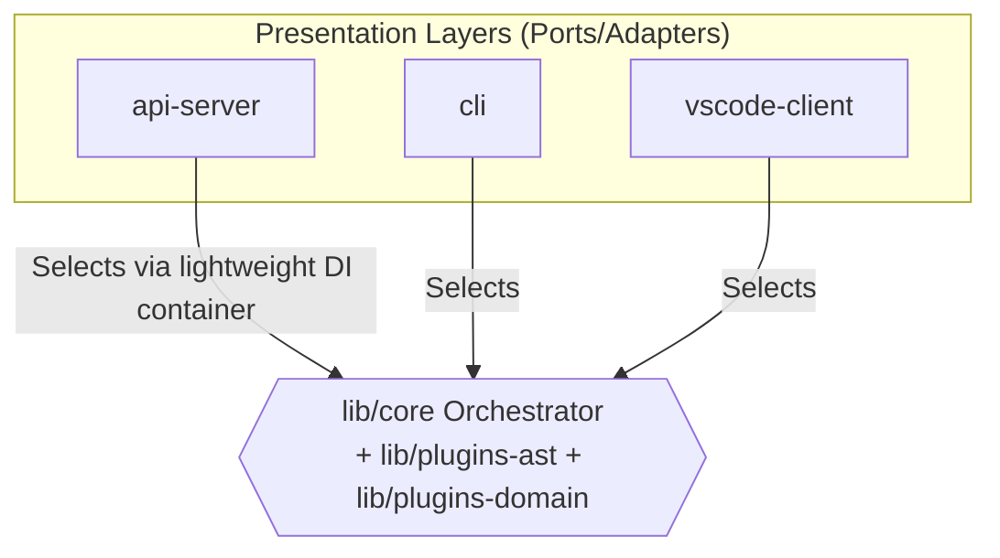

# Presentation Layer DI Composition

- **Status**: ⚠️ WARN
- **Phase**: Phase 6: Architecture Hardening & Security
- **Evidence / Verification Target**: `artifacts/api-server/src/di.ts`

## Implementation Details

This feature is anchored by the following core components:

[`artifacts/api-server/src/di.ts`](../../../../artifacts/api-server/src/di.ts)

### Architecture Flow

### Component Description

- **Core Logic**: `api-server` composes `lib/core`, `lib/plugins-ast`, and `lib/plugins-domain` via a lightweight DI container (`artifacts/api-server/src/di.ts`) instead of instantiating business logic inline, so `cli` and `vscode-client` can select the same plugins without duplicating logic — per [ADR-021](../../adr/ADR-021-shared-core-api-and-presentation-layers.md)'s Parity and Naming Rule and the [System Architecture Refactoring Plan](../../development/refactoring-plan.md#phase-5-presentation-layer-assembly).
- **State Management**: Persists or queries state directly via the defined interfaces.

## Testing & Verification

- Run `pnpm test` in the relevant workspace.
- Validate the behavior locally using `docuvia` CLI or the VS Code Extension.
- Check the [Regression & Parity Testing](../../guidelines/regression-and-parity-testing.md) guidelines.
