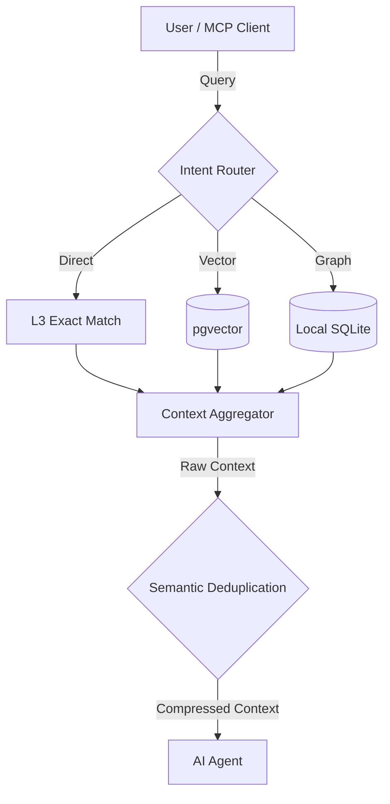

# Semantic Deduplication in Agentic RAG

- **Status**: ⚠️ WARN
- **Phase**: Phase 3: Agentic RAG & MCP Interfaces
- **Evidence / Verification Target**: `lib/core/src/services/router/intent-router.service.ts`, `lib/ast-core/src/compression.ts`
- **ADR**: [ADR-028](../../adr/ADR-028-semantic-deduplication-in-agentic-rag.md)

## Implementation Details

This is done. The naive truncation version (`lib/core/src/utils/compression.ts`) no longer exists as source (only stale `dist/*.d.ts` build artifacts remain — safe to ignore/clean up). `intent-router.service.ts` already imports `dedupNodes`/`sortByConfidence` from `@workspace/ast-core` and applies them via `_deduplicateResults()` on every routing path.

All 3 original goals are complete:

1. ~~Kill the naive truncation version located in `lib/core/src/utils/compression.ts`.~~ Done — file removed.
2. ~~Wire up the robust, confidence-sorted, deduplicated version in `lib/ast-core/src/compression.ts`.~~ Done — it's the active implementation.
3. ~~Update `intent-router.ts` to use this proper deduplication logic before passing context to the LLM.~~ Done — see `_deduplicateResults()`.

### Architecture Flow

### Component Description

- **`lib/ast-core/src/compression.ts`**: The canonical source for robust, confidence-sorted context compression and deduplication — actively used.
- **`lib/core/src/utils/compression.ts`**: The naive truncation version — already removed from source; only stale `dist/*.d.ts` build artifacts remain.
- **`intent-router.service.ts`**: Pipes aggregated raw context through `_deduplicateResults()` (using `dedupNodes`/`sortByConfidence` from `ast-core`) before returning it to the LLM.

## Testing & Verification

- Run `pnpm test` in the relevant workspace.
- Validate the behavior locally using `docuvia` CLI or the VS Code Extension.
- Check the [Regression & Parity Testing](../../guidelines/regression-and-parity-testing.md) guidelines.
