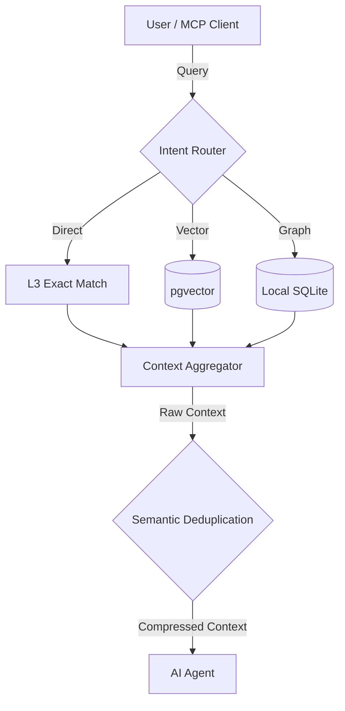

# Semantic Deduplication in Agentic RAG

- **Status**: ✅ Done
- **Phase**: Phase 3: Agentic RAG & MCP Interfaces
- **Evidence / Verification Target**: Intercept and compress queries in `intent-router.ts`
- **ADR**: [ADR-028](../../adr/ADR-028-semantic-deduplication-in-agentic-rag.md)

## Implementation Details

Currently, Docuvia has two versions of compression logic. This feature aims to standardize on the robust version and remove the naive version.

The specific technical goals are:

1. Kill the naive truncation version located in `lib/core/src/utils/compression.ts`.
2. Replace it by wiring up the robust, confidence-sorted, deduplicated version that currently sits unused as orphan code in `lib/ast-core/src/compression.ts`.
3. Update `intent-router.ts` to use this proper deduplication logic before passing context to the LLM.

### Architecture Flow

### Component Description

- **`lib/ast-core/src/compression.ts`**: The canonical source for robust, confidence-sorted context compression and deduplication.
- **`lib/core/src/utils/compression.ts`**: The naive truncation version that will be deleted.
- **`intent-router.ts`**: The intent router needs to be updated to pipe the aggregated raw context through the deduplication logic from `ast-core` before returning it to the LLM.

## Testing & Verification

- Run `pnpm test` in the relevant workspace.
- Validate the behavior locally using `docuvia` CLI or the VS Code Extension.
- Check the [Regression & Parity Testing](../../guidelines/regression-and-parity-testing.md) guidelines.
