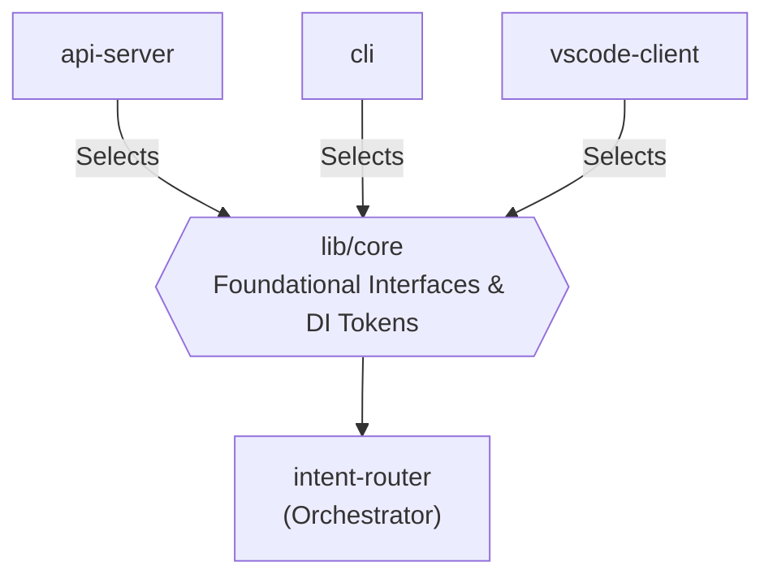

# Shared Core DI Orchestrator

- **Status**: ⚠️ WARN
- **Phase**: Phase 6: Architecture Hardening & Security
- **Evidence / Verification Target**: `lib/core/src/interfaces/intent-router.interfaces.ts`

## Implementation Details

This feature is anchored by the following core components:

[`lib/core/src/interfaces/intent-router.interfaces.ts`](../../../../lib/core/src/interfaces/intent-router.interfaces.ts), [`lib/core/src/services/intent-router.ts`](../../../../lib/core/src/services/intent-router.ts)

### Architecture Flow

### Component Description

- **Core Logic**: Foundational interfaces, dependency-injection tokens, and orchestrators (e.g. `intent-router`) live in `lib/core` rather than inside any single presentation artifact, preventing `lib/core` from becoming a monolithic "God Package" per [ADR-021](../../adr/ADR-021-shared-core-api-and-presentation-layers.md) and the [System Architecture Refactoring Plan](../../development/refactoring-plan.md#phase-2-prevent-core-from-becoming-a-god-package).
- **State Management**: Persists or queries state directly via the defined interfaces.

## Testing & Verification

- Run `pnpm test` in the relevant workspace.
- Validate the behavior locally using `docuvia` CLI or the VS Code Extension.
- Check the [Regression & Parity Testing](../../guidelines/regression-and-parity-testing.md) guidelines.
