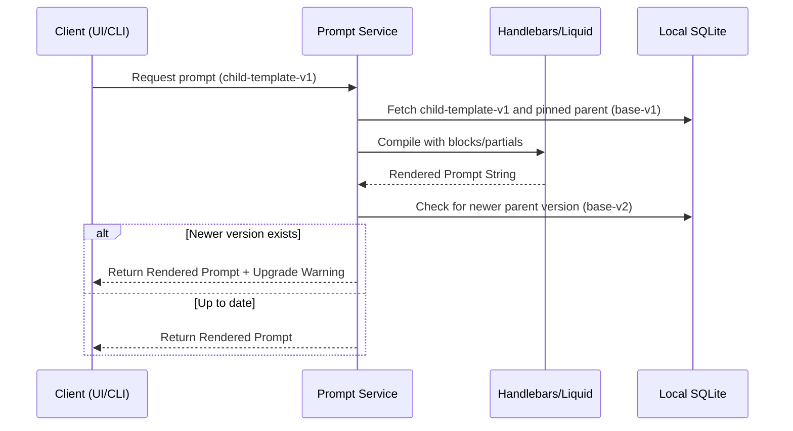

# Template management & Inheritance

- **Status**: ✅ Done
- **Phase**: Phase 4: Git-Isomorphic Sync & Temporal Knowledge
- **Evidence / Verification Target**: `lib/core/src/services/prompt-service.ts` — needs integration of Handlebars/Liquid and version pinning
- **ADR**: [ADR-030](../../adr/ADR-030-template-management-and-inheritance.md)

## Implementation Details

This feature introduces a robust template inheritance model using an industry-standard template engine and strict version pinning to prevent breaking changes.

### Core Goals

1. **Handlebars/Liquid Integration**: Integrate a mature templating engine (e.g., Handlebars or Liquid) in `prompt-service.ts` to natively handle partials and block-level inheritance instead of building a custom parser.
2. **Schema Migration for Versioning**: Update the database schema to support immutable, versioned templates.
3. **Strict Version Pinning**: Child templates must reference a specific version of their parent (e.g., `global-base-v1`) and will never auto-upgrade.
4. **Warning UX**: Implement a UI/CLI notification mechanism that alerts users when a newer version of their parent template is available, prompting manual review and migration.

### Architecture Flow

### Component Description

- **`lib/core/src/services/prompt-service.ts`**: Will be refactored to wrap the Handlebars/Liquid engine. It will handle fetching the correct pinned versions and detecting if a newer parent version exists to append warning metadata.
- **State Management**: Persists immutable template versions and relationships in the local SQLite database.

## Testing & Verification

- Run `pnpm test` in the relevant workspace.
- Validate that child templates successfully inherit and override blocks using the standard syntax of the chosen templating engine.
- Verify that updating a parent template (creating a `v2`) does NOT affect existing child templates pinned to `v1`.
- Confirm that the UI/CLI correctly surfaces an upgrade warning when a `v2` parent is available for a `v1` child.
- Check the [Regression & Parity Testing](../../guidelines/regression-and-parity-testing.md) guidelines.
