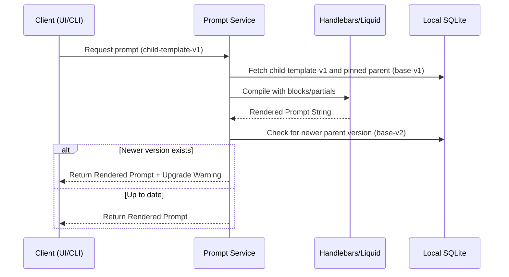

# Template management & Inheritance

- **Status**: ⚠️ WARN
- **Phase**: Phase 4: Git-Isomorphic Sync & Temporal Knowledge
- **Evidence / Verification Target**: `lib/core/src/services/prompt-service.ts`, `lib/db/src/schema/pg/prompt-templates.ts`
- **ADR**: [ADR-030](../../adr/ADR-030-template-management-and-inheritance.md)

## Implementation Details

Implemented as of commit `a2d1905` (2026-07-07, "feat(templates): implement Handlebars template inheritance and schema versions"). `prompt-service.ts` imports and compiles templates with `Handlebars` (`hbs.compile()`), registers parent templates as partials, and implements version pinning with upgrade-warning detection (`hasUpgradeWarning`, `latestParentVersion`). `prompt-templates.ts` has `parentTemplateId` and `version` columns.

### Core Goals

1. ~~**Handlebars/Liquid Integration**~~ Done — `prompt-service.ts` uses Handlebars for partials and block-level inheritance.
2. ~~**Schema Migration for Versioning**~~ Done — `prompt-templates.ts` has `version`/`parentTemplateId` columns.
3. ~~**Strict Version Pinning**~~ Done — child templates pin to a specific parent version via `parentTemplateId`.
4. **Warning UX**: `hasUpgradeWarning`/`latestParentVersion` exist at the service layer — verify a UI/CLI surface actually renders this warning to the user before marking fully complete.

### Architecture Flow

### Component Description

- **`lib/core/src/services/prompt-service.ts`**: Will be refactored to wrap the Handlebars/Liquid engine. It will handle fetching the correct pinned versions and detecting if a newer parent version exists to append warning metadata.
- **State Management**: Persists immutable template versions and relationships in the local SQLite database.

## Testing & Verification

- Run `pnpm test` in the relevant workspace.
- Validate that child templates successfully inherit and override blocks using the standard syntax of the chosen templating engine.
- Verify that updating a parent template (creating a `v2`) does NOT affect existing child templates pinned to `v1`.
- Confirm that the UI/CLI correctly surfaces an upgrade warning when a `v2` parent is available for a `v1` child.
- Check the [Regression & Parity Testing](../../guidelines/regression-and-parity-testing.md) guidelines.
