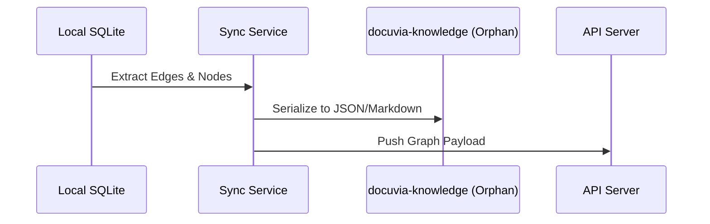

# Temporal Decay Scoring

- **Status**: ⚠️ WARN
- **Phase**: Phase 4: Git-Isomorphic Sync & Temporal Knowledge
- **Evidence / Verification Target**: `lib/core/src/services/temporal-decay.calculator.ts`

## Implementation Details

This feature is anchored by the following core components:

[`lib/core/src/services/temporal-decay.calculator.ts`](../../../../lib/core/src/services/temporal-decay.calculator.ts)

### Architecture Flow

### Component Description

- **Core Logic**: Handled primarily within the target files linked above.
- **State Management**: Persists or queries state directly via the defined interfaces.

## Testing & Verification

- Run `pnpm test` in the relevant workspace.
- Validate the behavior locally using `docuvia` CLI or the VS Code Extension.
- Check the [Regression & Parity Testing](../../guidelines/regression-and-parity-testing.md) guidelines.
