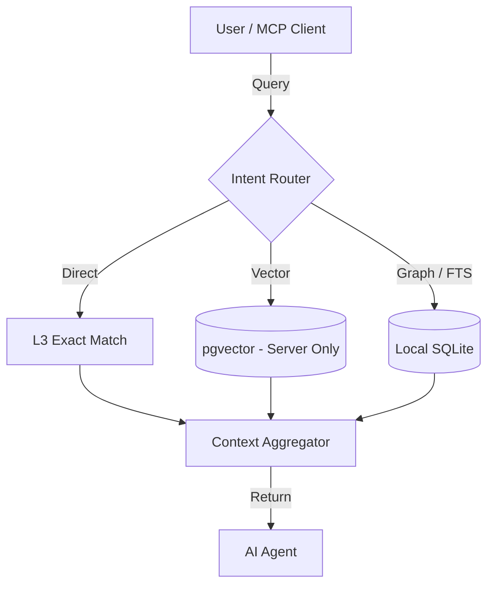

# Vector Index & Search

- **Status**: ✅ Done (Deprecated/Server-Only)
- **Phase**: Phase 3: Agentic RAG & MCP Interfaces
- **Evidence / Verification Target**: `lib/core/src/services/intent-router.ts`
- **ADR**: [ADR-029](../../adr/ADR-029-local-vector-index-and-natural-language-ui.md)

## Implementation Details

This feature is anchored by the following core components:

[`lib/core/src/services/intent-router.ts`](../../../../lib/core/src/services/intent-router.ts)

Vector index search is officially designated as a **Server-Only** feature powered by `pgvector` on the API Server.

Local vector search (previously planned via `sqlite-vec`) has been **canceled** to prevent local compute/OOM issues and application bloat. Any `NotImplementedError` stubs for local vector search have been removed from the codebase. Local clients gracefully degrade to using SQLite FTS5 and Graph traversal as per ADR-029 and ADR-002.

### Architecture Flow

### Component Description

- **Core Logic**: Handled primarily within the target files linked above.
- **State Management**: Persists or queries state directly via the defined interfaces.

## Testing & Verification

- Run `pnpm test` in the relevant workspace.
- Validate the behavior locally using `docuvia` CLI or the VS Code Extension.
- Check the [Regression & Parity Testing](../../guidelines/regression-and-parity-testing.md) guidelines.
