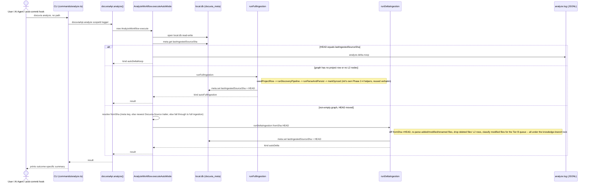
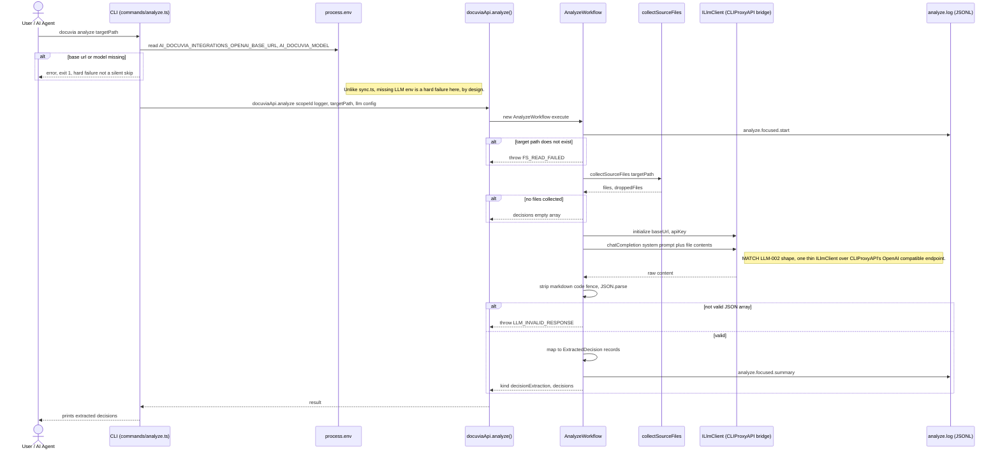

# `analyze` — Execution Flow vs. Architecture Decisions

> Method: ADR context from `docs/gitbook/adr/**`; call sequence traced from
> `artifacts/cli/src/commands/analyze.ts` through `lib/ui-core/src/workflows/analyze/analyze-workflow.ts`.
>
> **Updated for PLAT-007 Tier A** (see
> [PLAT-007's Tier A section](../adr/platform/PLAT-007-tiered-background-knowledge-evolution.md#tier-a--every-commit-ast-delta-only-deterministic-sub-second)):
> no-arg `analyze` is no longer a read-only config scan — it is now **auto mode**, dispatching to
> a sha fast-path no-op, full ingestion, or delta ingestion. The old config-scan-only diagram below
> is superseded by Mode A's new dispatch.

`docuvia analyze` is two genuinely different flows dispatched on one condition — whether
`targetPath` was given — so it gets two diagrams rather than one artificially merged one.

## Mode A — No `targetPath`: Auto Mode (Ingestion)

## Mode B — `targetPath` given: Focused LLM Decision Extraction

## Step → ADR Mapping

| Step                                                                                            | Governing ADR(s)                                                                                                                           | Verdict                                      |
| ----------------------------------------------------------------------------------------------- | ------------------------------------------------------------------------------------------------------------------------------------------ | -------------------------------------------- |
| Auto mode (fast-path / full ingestion / delta ingestion)                                        | [PLAT-007](../adr/platform/PLAT-007-tiered-background-knowledge-evolution.md#tier-a--every-commit-ast-delta-only-deterministic-sub-second) | ✅ Match                                     |
| Config scan (project type + tags) — now a step of full ingestion, not the whole command         | — (no dedicated ADR; feeds `init`'s discovery pipeline)                                                                                    | —                                            |
| `ILlmClient` over CLIProxyAPI's OpenAI-compatible endpoint, config injected via `docuviaMemory` | [LLM-002](../adr/llm/LLM-002-cliproxyapi-bridge.md)                                                                                        | ✅ Match                                     |
| Missing LLM env vars → hard failure (exit 1), not silent skip                                   | code comment in `analyze.ts` contrasting itself with `sync.ts`'s missing-env behavior                                                      | ✅ Match (internally consistent, deliberate) |
| `analyze.start`/`analyze.focused.start`/`.summary` JSONL log                                    | [IFCE-003](../adr/interface/IFCE-003-persisted-structured-command-log.md)                                                                  | ✅ Match                                     |

## Conflicts Found

None. [LLM-002](../adr/llm/LLM-002-cliproxyapi-bridge.md) is marked "Accepted / Fully Verified"
and `AnalyzeWorkflow.executeDecisionExtraction()` (`analyze-workflow.ts`) resolves `TOKENS.LlmClient`,
calls `chatCompletion()`, and parses the response into `ExtractedDecision` records — a complete,
working consumer, matching LLM-002's decision exactly (one thin client, OpenAI-compatible endpoint,
config injected via `docuviaMemory`). Since Slice 4, the Tier C budgeted queue
([PLAT-007](../adr/platform/PLAT-007-tiered-background-knowledge-evolution.md#tier-c--async-queue-with-budget-llm-l3-extraction))
is a second consumer of the same client.
