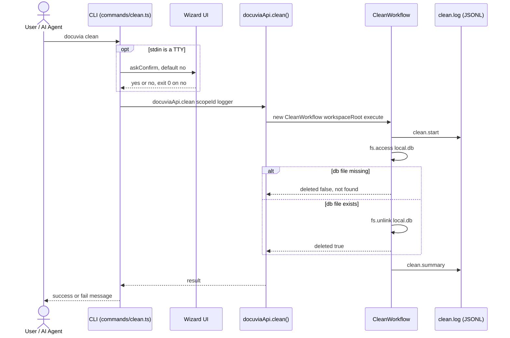

# `clean` — Execution Flow vs. Architecture Decisions

> Method: ADR context from `docs/gitbook/adr/**`; call sequence traced from
> `artifacts/cli/src/commands/clean.ts` through `lib/ui-core/src/workflows/clean/clean-workflow.ts`.

`docuvia clean` wholesale-deletes `.docuvia/local.db`. Per [STOR-002](../adr/storage/STOR-002-sqlite-ephemeral-query-engine.md),
`local.db` is defined as an **ephemeral query engine** — disposable by design, rebuildable from the
`docuvia-knowledge` git branch via `hydrate` — so this command is intentionally a blunt, wholesale
delete rather than a surgical one.

## Sequence Diagram

## Step → ADR Mapping

| Step                                      | Governing ADR(s)                                                                                                          | Verdict  |
| ----------------------------------------- | ------------------------------------------------------------------------------------------------------------------------- | -------- |
| Wholesale delete of `local.db`            | [STOR-002](../adr/storage/STOR-002-sqlite-ephemeral-query-engine.md) point 1 ("disposable... can be deleted at any time") | ✅ Match |
| `clean.start` / `clean.summary` JSONL log | [IFCE-003](../adr/interface/IFCE-003-persisted-structured-command-log.md)                                                 | ✅ Match |
| TTY confirm, default **no**               | `guidelines/design-spirit.md` (destructive-by-default caution)                                                            | ✅ Match |

## Conflicts Found

None. `clean`'s behavior matches STOR-002 and IFCE-003 exactly.

## Observation (not a conflict)

`CleanWorkflow`'s doc comment (`clean-workflow.ts:9`) points at `IGraphStore.pruneMissingFiles` as
"the surgical alternative, not currently wired to any command." That method exists in the schema
layer but no CLI/MCP command currently calls it — `clean` is the only way to shed stale rows today,
and it always takes the whole database with it. Not a conflict against any ADR (none mandates a
surgical-prune command), just a capability that exists in code but isn't reachable yet.
