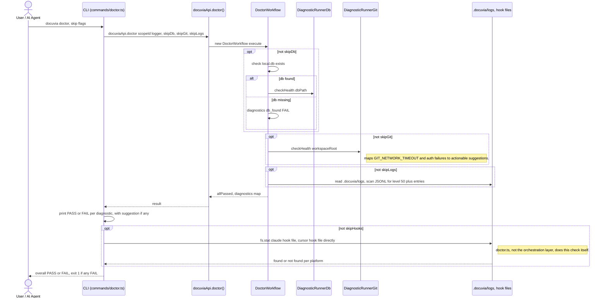

# `doctor` — Execution Flow vs. Architecture Decisions

> Method: ADR context from `docs/gitbook/adr/**`; call sequence traced from
> `artifacts/cli/src/commands/doctor.ts` through `lib/ui-core/src/workflows/doctor/doctor-workflow.ts`.

`docuvia doctor` runs a set of independent diagnostics. It's the one command whose CLI layer does
real diagnostic work itself (the hooks check) rather than delegating everything to `docuviaApi`.

## Sequence Diagram

## Step → ADR Mapping

| Step                                                                             | Governing ADR(s)                                                                  | Verdict                                             |
| -------------------------------------------------------------------------------- | --------------------------------------------------------------------------------- | --------------------------------------------------- |
| DB / git / logs diagnostics via `docuviaApi.doctor()`                            | `architecture/virtual-contracts-architecture.md` (Orchestration Layer)            | ✅ Match                                            |
| Git diagnostics map specific error codes to actionable suggestions               | `architecture/error-handling-architecture.md`                                     | ✅ Match                                            |
| Hooks check runs directly in `doctor.ts` via `fs.stat`, not through `docuviaApi` | `architecture/virtual-contracts-architecture.md` (Presentation Layer constraints) | ⚠️ **Asymmetric, not a hard violation** — see below |

## Conflicts Found

None rising to a hard ADR violation.

### Observation: the hooks check is the one diagnostic the Presentation layer runs itself

`virtual-contracts-architecture.md` scopes the Presentation layer's job as "parses user input, calls
`docuviaApi`, and formats the output," and its only explicit constraint is being "strictly forbidden
from accessing `lib/core`, `lib/schema`, or any underlying implementations directly." `doctor.ts`'s
hooks check (`fs.stat` on the Claude/Cursor hook file paths, lines 79-100) doesn't reach into
`lib/core`/`lib/schema`, so it doesn't break that specific rule — but it does mean `doctor` has two
different shapes for what should be the same kind of check: three diagnostics (`db`, `git`, `logs`)
go through `DoctorWorkflow`/`docuviaApi.doctor()` in the Orchestration layer, while the fourth
(`hooks`) is plain filesystem logic living directly in the CLI command. `DoctorOptions` is even
duplicated as two separate interfaces (`doctor-workflow.ts:15-19` and `doctor.ts:22-27`) with
`skipHooks` only on the CLI-side one. Not a conflict against any stated rule, but an asymmetry worth
resolving — either fold the hooks check into `DoctorWorkflow` alongside the other three, or document
why hooks specifically are presentation-layer-only.
