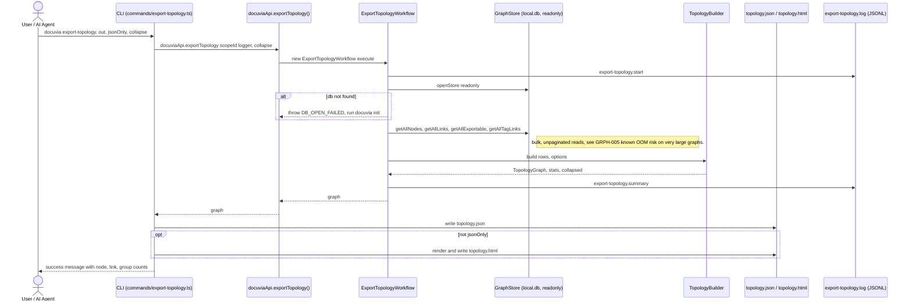

# `export-topology` — Execution Flow vs. Architecture Decisions

> Method: ADR context from `docs/gitbook/adr/**`; call sequence traced from
> `artifacts/cli/src/commands/export-topology.ts` through
> `lib/ui-core/src/workflows/export-topology/export-topology-workflow.ts`.

`docuvia export-topology` bulk-reads the whole graph and projects it into `topology.json` (and an
optional `topology.html` viewer). Unlike the other read-path commands, it does **not** call
`ensureHydrated()` first.

## Sequence Diagram

## Step → ADR Mapping

| Step                                                                                       | Governing ADR(s)                                                          | Verdict                                                   |
| ------------------------------------------------------------------------------------------ | ------------------------------------------------------------------------- | --------------------------------------------------------- |
| Bulk `getAllNodes`/`getAllLinks`/`getAllExportable`/`getAllTagLinks` reads                 | [GRPH-005](../adr/graph/GRPH-005-read-side-query-layer.md)                | ⚠️ **ADR's own documented risk applies here** — see below |
| `l3.getAllExportable()` only returns exportable (non-`Garbage`) L3 rows                    | [GRPH-002](../adr/graph/GRPH-002-two-phase-knowledge-validity.md)         | ✅ Match                                                  |
| File writing (`topology.json`/`.html`) happens in the Presentation layer, not the workflow | `architecture/virtual-contracts-architecture.md`                          | ✅ Match                                                  |
| `export-topology.start` / `.summary` JSONL log                                             | [IFCE-003](../adr/interface/IFCE-003-persisted-structured-command-log.md) | ✅ Match                                                  |

## Conflicts Found

None — but one ADR-documented risk is directly exercised here, worth flagging rather than a silent
pass.

### GRPH-002's Two-Phase Knowledge Validity is `proposed`, not `accepted`

[GRPH-002](../adr/graph/GRPH-002-two-phase-knowledge-validity.md)'s front matter status is still
`proposed`. `export-topology` already depends on its `validity_status` model working correctly
(`store.l3.getAllExportable()` is presumably the method that filters out `Draft`/`Garbage` nodes) —
so a decision the ADR tree marks as not-yet-accepted is already load-bearing in shipped code. Not a
contradiction, just worth promoting GRPH-002 to `accepted` (or documenting why it's still
`proposed` despite being depended on) so the ADR status reflects reality.

### GRPH-005's documented OOM risk is real for this command specifically

[GRPH-005](../adr/graph/GRPH-005-read-side-query-layer.md) names `getAllNodes`/`getAllLinks`
loading the entire dataset into memory, without pagination, as a known Negative consequence — and
calls out "topology export" by name as one of the operations exposed to it. This isn't a conflict
(the ADR predicted exactly this), just confirmation that `export-topology` is the sharpest edge of
that already-accepted risk, since it's the one command that always reads every node and every link
in a single pass with no filtering.
