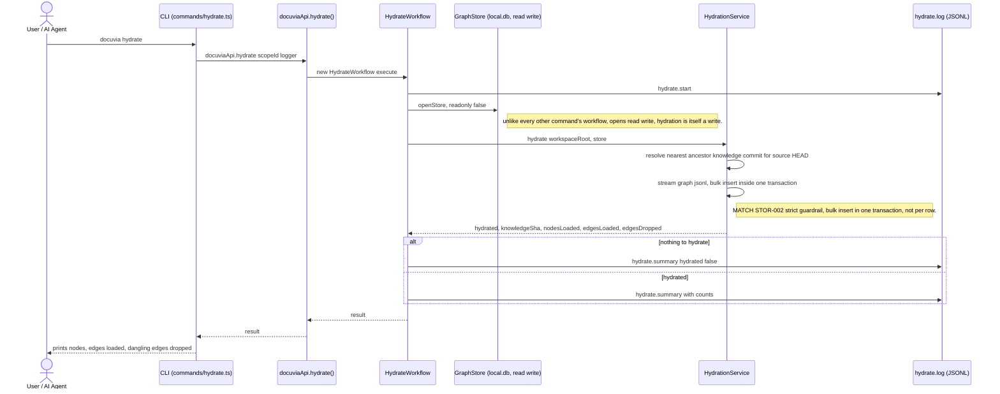

# `hydrate` — Execution Flow vs. Architecture Decisions

> Method: ADR context from `docs/gitbook/adr/**`; call sequence traced from
> `artifacts/cli/src/commands/hydrate.ts` through `lib/ui-core/src/workflows/hydrate/hydrate-workflow.ts`.

`docuvia hydrate` is the explicit, always-runs counterpart to `snapshot`: it resolves the
knowledge-branch commit matching the current source `HEAD` (or its nearest analyzed ancestor) and
bulk-loads `graph/*.jsonl` into `local.db`, wholesale replacing `l2_nodes`/`node_links`. It's the
same `IHydrationService` that `ensureHydrated()` (used by `query`/`impact`/`status`/`review`) wraps
for the automatic staleness-check path — this is the manual, unconditional path.

## Sequence Diagram

## Step → ADR Mapping

| Step                                                                                | Governing ADR(s)                                                                                     | Verdict                     |
| ----------------------------------------------------------------------------------- | ---------------------------------------------------------------------------------------------------- | --------------------------- |
| Rebuild-not-upsert: wipe and bulk-reload, never diff against existing rows          | [STOR-002](../adr/storage/STOR-002-sqlite-ephemeral-query-engine.md) point 2                         | ✅ Match                    |
| Bulk insert inside one transaction, not row-by-row auto-commit                      | [STOR-002](../adr/storage/STOR-002-sqlite-ephemeral-query-engine.md) "Strict Performance Guardrails" | ✅ Match (see caveat below) |
| Nearest-ancestor source-commit resolution (multi-branch/rollback safe)              | [STOR-002](../adr/storage/STOR-002-sqlite-ephemeral-query-engine.md) "Source-Commit Lookup"          | ✅ Match                    |
| Same `IHydrationService` backs both `hydrate` and `ensureHydrated()`'s auto-trigger | [STOR-002](../adr/storage/STOR-002-sqlite-ephemeral-query-engine.md)                                 | ✅ Match                    |
| `hydrate.start` / `hydrate.summary` JSONL log                                       | [IFCE-003](../adr/interface/IFCE-003-persisted-structured-command-log.md)                            | ✅ Match                    |

## Conflicts Found

None found for `hydrate`'s own logic — but it resolves a documentation conflict already flagged
elsewhere in this doc set: [init's Conflict #2](init-execution-flow.md#conflicts-found) notes that
[STOR-002](../adr/storage/STOR-002-sqlite-ephemeral-query-engine.md)'s own "Known implementation
gap" note claims _"no hydration code exists anywhere in the codebase."_ Tracing `hydrate` directly
confirms that note is simply stale — `HydrationService`, `HydrateWorkflow`, and `ensure-hydrated.ts`
are all real, wired-up, and exercised by five different commands (`hydrate` itself, plus the
auto-trigger in `query`/`impact`/`status`/`review`). No new finding here, just corroboration from
tracing the command STOR-002 claims doesn't exist.

**Not independently verified from this command's code alone**: the "< 10 seconds for 100,000 nodes"
performance guardrail STOR-002 prescribes. `hydrationService.hydrate()`'s implementation wasn't read
line-by-line for this doc (only its call sites and result shape) — a future pass should check
whether the bulk-insert path actually uses `better-sqlite3` prepared statements as STOR-002 mandates
as the fallback if the ORM proves too slow, and whether FTS5 triggers are dropped/rebuilt around the
bulk load as STOR-002 suggests.
