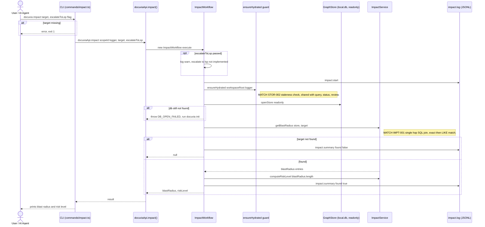

# `impact` — Execution Flow vs. Architecture Decisions

> Method: ADR context from `docs/gitbook/adr/**`; call sequence traced from
> `artifacts/cli/src/commands/impact.ts` through `lib/ui-core/src/workflows/impact/impact-workflow.ts`.

`docuvia impact` is a 1-hop blast-radius lookup by target name (exact match, then `LIKE`). It
shares the automatic staleness-check hydration guard with `query`, `status`, and `review`.

## Sequence Diagram

## Step → ADR Mapping

| Step                                                                       | Governing ADR(s)                                                          | Verdict                             |
| -------------------------------------------------------------------------- | ------------------------------------------------------------------------- | ----------------------------------- |
| Staleness-check auto-hydrate before read                                   | [STOR-002](../adr/storage/STOR-002-sqlite-ephemeral-query-engine.md)      | ✅ Match                            |
| 1-hop SQL JOIN blast radius (exact-then-LIKE) as the fast heuristic filter | [IMPT-001](../adr/impact/IMPT-001-sql-single-hop-blast-radius.md)         | ✅ Match                            |
| `escalateToLsp` accepted as a flag                                         | [IMPT-003](../adr/impact/IMPT-002-lsp-for-absolute-quality.md)            | ⚠️ **Documented no-op** — see below |
| `impact.start` / `impact.summary` JSONL log                                | [IFCE-003](../adr/interface/IFCE-003-persisted-structured-command-log.md) | ✅ Match                            |

## Conflicts Found

### `escalateToLsp` is accepted but does nothing — a known, self-documented gap against IMPT-003

[IMPT-003](../adr/impact/IMPT-002-lsp-for-absolute-quality.md) mandates the LSP-escalation layer as
the actual quality guarantee, explicitly calling the SQL single-hop pass (IMPT-001) an
insufficient "first pass" filter that must not be trusted for automated refactoring decisions.
`ImpactWorkflow`'s own doc comment (`impact-workflow.ts:19`) is upfront about the gap: _"`escalateToLsp`
is accepted but treated as a documented no-op, matching old Docuvia — reserved for a future
TypeScript-compiler-backed precise-reference pass."_ This isn't a silent conflict — the code
self-discloses it — but it means `impact`'s blast radius is, today, always the IMPT-001 heuristic
layer only, never the IMPT-003 LSP-verified layer the ADR treats as mandatory for trustworthy
results. Flagged here because it's the same underlying gap [review](review-execution-flow.md) has,
just already acknowledged in a code comment rather than silent.
