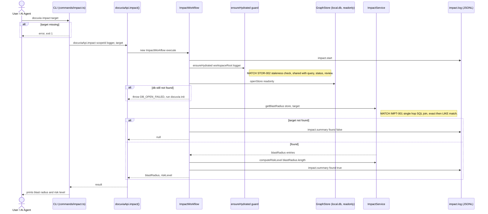

# `impact` — Execution Flow vs. Architecture Decisions

> Method: ADR context from `docs/gitbook/adr/**`; call sequence traced from
> `artifacts/cli/src/commands/impact.ts` through `lib/ui-core/src/workflows/impact/impact-workflow.ts`.

`docuvia impact` is a 1-hop blast-radius lookup by target name (exact match, then `LIKE`). It
shares the automatic staleness-check hydration guard with `query`, `status`, and `review`.

## Sequence Diagram

## Step → ADR Mapping

| Step                                                                       | Governing ADR(s)                                                          | Verdict  |
| -------------------------------------------------------------------------- | ------------------------------------------------------------------------- | -------- |
| Staleness-check auto-hydrate before read                                   | [STOR-002](../adr/storage/STOR-002-sqlite-ephemeral-query-engine.md)      | ✅ Match |
| 1-hop SQL JOIN blast radius (exact-then-LIKE) as the fast heuristic filter | [IMPT-001](../adr/impact/IMPT-001-sql-single-hop-blast-radius.md)         | ✅ Match |
| `impact.start` / `impact.summary` JSONL log                                | [IFCE-003](../adr/interface/IFCE-003-persisted-structured-command-log.md) | ✅ Match |

## Conflicts Found

### `escalateToLsp` removed (Slice 5, §10b) — no longer a gap to document

Prior revisions of this document flagged `escalateToLsp` as a self-disclosed no-op against
[IMPT-002](../adr/impact/IMPT-002-lsp-for-absolute-quality.md) — the flag was accepted by `impact`
but never implemented any LSP-escalation behavior. Per
[PLAT-007's reliability section](../adr/platform/PLAT-007-tiered-background-knowledge-evolution.md#reliability-slice-5-doctor)'s
owner ruling, the flag has been removed entirely (CLI wiring, `ImpactWorkflow` option,
`MemoryKeys.ESCALATE_TO_LSP` usage in
`impact.ts`/`impact-workflow.ts`) rather than given real behavior — a flag that visibly does
nothing is exactly the "no invisible failure" footgun the project's stance argues against.
`docuvia impact <target> --escalate-to-lsp` now reports an unknown-flag error like any other
unrecognized flag. `impact`'s blast radius remains the IMPT-001 heuristic layer only; a future
LSP-verified layer (if ever built) would need a new, real implementation, not this revived flag.
