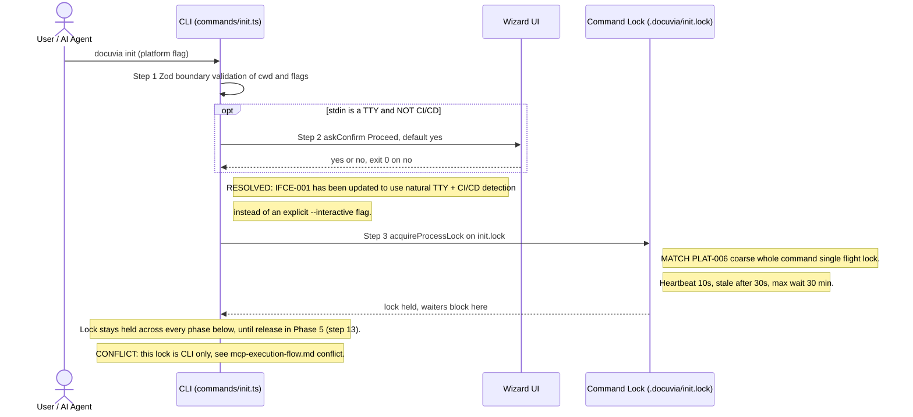
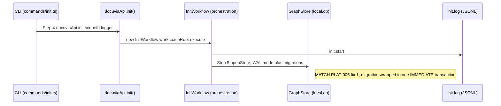
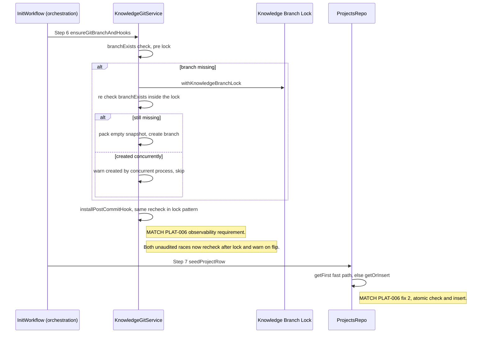
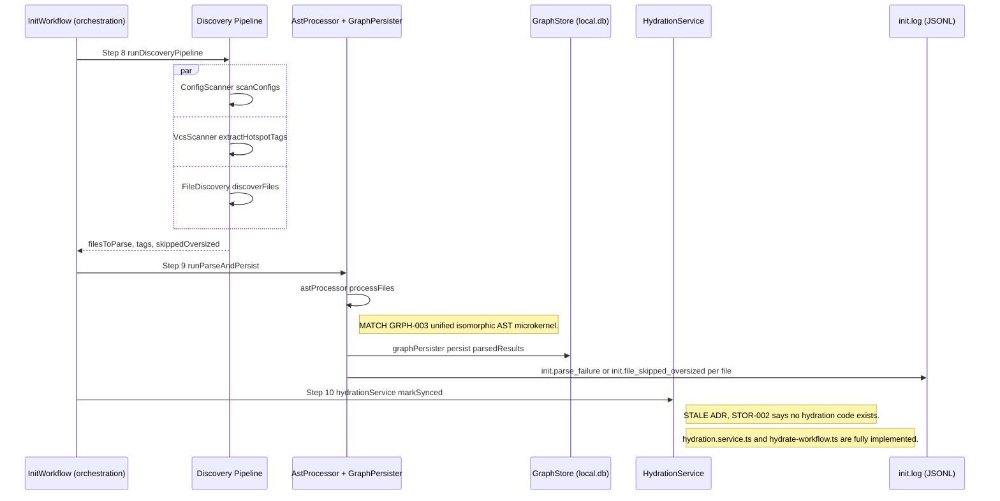
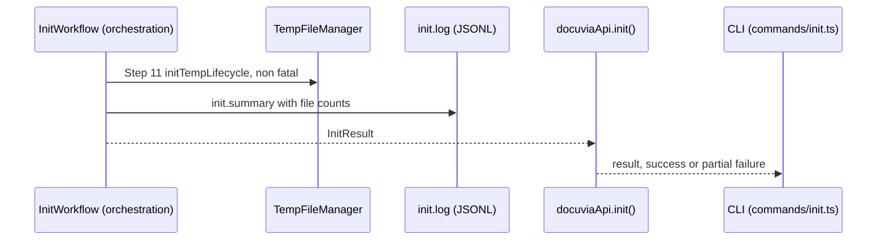
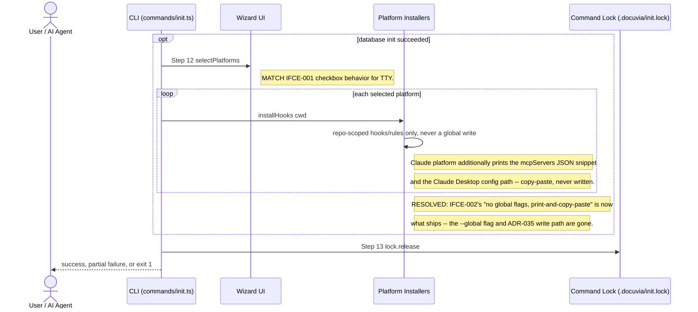

# `init` — Execution Flow vs. Architecture Decisions

> Method: ADR/design context was gathered from `docs/gitbook/adr/**` (the project's curated
> decision graph — `graphify-out/` only contains raw AST/semantic parse caches, not a separate
> readable knowledge graph, so the gitbook ADR tree is the authoritative source here). The actual
> call sequence below was traced directly through the source with GitNexus `query`/`context`/`Read`
> starting from `artifacts/cli/src/commands/init.ts`, not inferred from the ADRs.

This trace walks `docuvia init` from the CLI entry point down through the orchestration
(`InitWorkflow`) and domain-core layers, annotating each step with the ADR that governs it. Steps
are numbered to match the sequence diagram below.

## Sequence Diagram, by Phase

The full flow is one 13-step sequence across 15 collaborators — as a single diagram it renders
too wide to read. It's split below into six panels along `InitWorkflow`'s own phase boundaries
(the numbered phases in its doc comment), each keeping only the participants active in that phase.
Step numbers carry over unchanged, so they still line up with the mapping table and the conflicts
section further down.

### Phase 0 — CLI Entry, Confirmation & Command Lock (steps 1-3)

### Phase 1 — Orchestration Entry & Database Bootstrap (steps 4-5)

### Phase 2 — Knowledge Branch, Hook & Project Row (steps 6-7)

### Phase 3 — Discovery, Parse, Persist & Hydration Mark (steps 8-10)

### Phase 4 — Temp Lifecycle, Summary & Return (step 11)

### Phase 5 — Agent Integrations & Lock Release (steps 12-13)

## Step → ADR Mapping

| #   | Step                                                               | Governing ADR(s)                                                                                                                                                  | Verdict                         |
| --- | ------------------------------------------------------------------ | ----------------------------------------------------------------------------------------------------------------------------------------------------------------- | ------------------------------- |
| 1   | Zod boundary validation of CLI input                               | `guidelines/design-spirit.md` #4 (boundary validation)                                                                                                            | ✅ Match                        |
| 2   | TTY confirmation prompt                                            | [IFCE-001](../adr/interface/IFCE-001-wizard-style-interactive-cli.md)                                                                                             | ✅ Match                        |
| 3   | Whole-command single-flight lock                                   | [PLAT-006](../adr/platform/PLAT-006-init-single-flight-lock.md)                                                                                                   | ✅ Match                        |
| 5   | `openStore()` — WAL + `IMMEDIATE` migration transaction            | [PLAT-006](../adr/platform/PLAT-006-init-single-flight-lock.md), [STOR-002](../adr/storage/STOR-002-sqlite-ephemeral-query-engine.md)                             | ✅ Match                        |
| 6   | `ensureGitBranchAndHooks()` recheck-in-lock + warn                 | [PLAT-006](../adr/platform/PLAT-006-init-single-flight-lock.md), [STOR-001](../adr/storage/STOR-001-git-branch-source-of-truth.md) (branch-first-commit stamping) | ✅ Match                        |
| 7   | `seedProjectRow()` atomic `getOrInsert`                            | [PLAT-006](../adr/platform/PLAT-006-init-single-flight-lock.md)                                                                                                   | ✅ Match                        |
| 8   | Parallel discovery (config/VCS/file scan)                          | — (no ADR governs this directly; implementation detail)                                                                                                           | —                               |
| 9   | AST parse + persist                                                | [GRPH-003](../adr/graph/GRPH-003-unified-ast-microkernel.md)                                                                                                      | ✅ Match                        |
| 10  | `hydrationService.markSynced()`                                    | [STOR-002](../adr/storage/STOR-002-sqlite-ephemeral-query-engine.md)                                                                                              | ✅ Match (RESOLVED, see below)  |
| 11  | Temp-file manager init (non-fatal)                                 | `architecture/application-lifecycle-and-state.md`                                                                                                                 | ✅ Match                        |
| 12  | Platform selection (checkbox / `--platform` / headless-all)        | [IFCE-001](../adr/interface/IFCE-001-wizard-style-interactive-cli.md)                                                                                             | ✅ Match (this part of the ADR) |
| 12b | Repo-scoped hooks only; Claude Desktop MCP is print-and-copy-paste | [IFCE-002](../adr/interface/IFCE-002-strict-repo-scoped-boundaries.md)                                                                                            | ✅ Match (RESOLVED, see below)  |
| —   | `init.start` / `init.summary` JSONL log                            | [IFCE-003](../adr/interface/IFCE-003-persisted-structured-command-log.md)                                                                                         | ✅ Match                        |
| —   | Hidden `docuvia-knowledge` branch + post-commit hook               | [PLAT-004](../adr/platform/PLAT-004-zero-interruption-invisible-indexing.md)                                                                                      | ✅ Match                        |

## Conflicts Found

### 0. IFCE-002 says the `--global` flag was removed entirely; it was still live (RESOLVED)

This conflict has been resolved. [ADR-035](../adr/legacy/ADR-035-opt-in-global-side-effect-gating.md)
(2026-07-11) introduced an opt-in `--global` flag so `init` could register Docuvia's MCP server into
the machine-global Claude Desktop config; it was superseded a day later by
[IFCE-002](../adr/interface/IFCE-002-strict-repo-scoped-boundaries.md), which reverses the decision
outright — but the code kept implementing the superseded ADR-035 behavior until this fix.

`CLI_FLAGS.GLOBAL`/`allowGlobalMcpConfig` has been removed end-to-end (`cli.ts`, `init.ts`,
`uninstall.ts`, `IIntegrationManager`, every platform). `claude.platform.ts`'s
`maybeConfigureMcpServer`/`configureMcpServer` (the direct `claude_desktop_config.json` writer) is
gone, replaced by `printMcpServerSnippet` — `installHooks` now only ever touches the repo-scoped
`.claude/hooks/` directory and prints the `mcpServers` JSON snippet plus the resolved config path
for the user to copy-paste, exactly matching IFCE-002 decision #3. `uninstall`'s best-effort removal
of a legacy global MCP entry (if one exists from an older Docuvia version) was kept — it's a
cleanup-only, read-then-delete operation that never writes, scoped to undoing what a prior version
of `init` might have done.

### 1. IFCE-001 requires an `--interactive` flag; the code has none (RESOLVED)

This conflict has been successfully resolved. [IFCE-001](../adr/interface/IFCE-001-wizard-style-interactive-cli.md) has been updated to reflect the design team's decision to abolish the `--interactive` flag. The CLI now elegantly and automatically uses local non-CI/CD TTY-autodetection (`process.stdin.isTTY && !process.env.CI`) as the natural interactive trigger, which aligns perfectly with both the user-facing documentation and the underlying implementation.

### 2. STOR-002 claims "no hydration code exists anywhere in the codebase" — no longer true (RESOLVED)

This conflict has been successfully resolved. [STOR-002](../adr/storage/STOR-002-sqlite-ephemeral-query-engine.md)'s "Known implementation gap" note has been updated to reflect that the hydration pipeline (JSONL-to-SQLite direction) described in the ADR has been fully implemented in `hydration.service.ts` with `resolveHydrationCommit` (Nearest-Ancestor resolution) and `hydrate` bulk-loading. Leaving no stale gap claims in the ADR tree.

### 3. PLAT-006's command-level lock was CLI-only — the MCP entry point bypassed it entirely (RESOLVED 2026-07-18)

Full detail lives in [mcp-execution-flow.md](mcp-execution-flow.md#conflicts-found). `artifacts/cli/src/mcp/tools/init.ts`'s
`docuvia_init` tool used to call `docuviaApi.init()` directly, never through `initCommand()`, so it
never called `acquireProcessLock` at all — the one entry point PLAT-006 (2026-07-14) names as the
motivating scenario for the coarse lock, and the one that didn't have it. **Resolved**: the lock
acquire/release sequence is now a shared `withInitCommandLock` helper both `initCommand()` and the
MCP tool call through; see the MCP doc for the fix and its regression test.

## Non-conflicts worth calling out

Everything PLAT-006 (2026-07-14, the newest and most detailed ADR touching `init`) describes as
_already shipped_ — the migration `IMMEDIATE` transaction, the `ProjectsRepo.getOrInsert()` atomic
insert, and the recheck-after-lock-plus-warn pattern on both the knowledge-branch creation and
post-commit-hook install races — is faithfully implemented exactly as decided, on both the CLI and
MCP paths now (Conflict #3 above), including the `writeOrAppend()` fix (distinguishing `ENOENT`
from other read errors before treating a file as absent) that the ADR flagged as a
related-but-independent latent bug.
