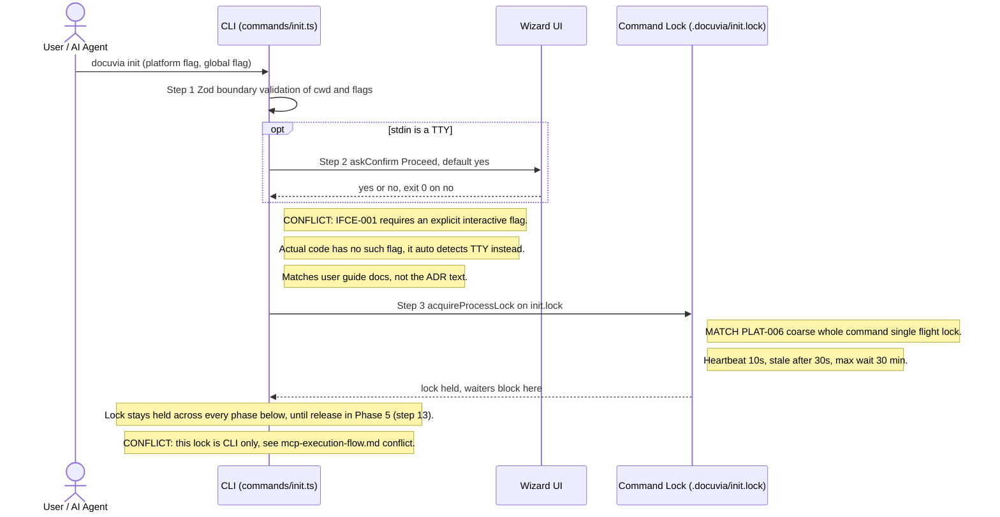
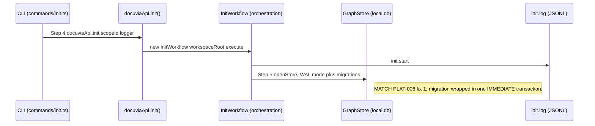
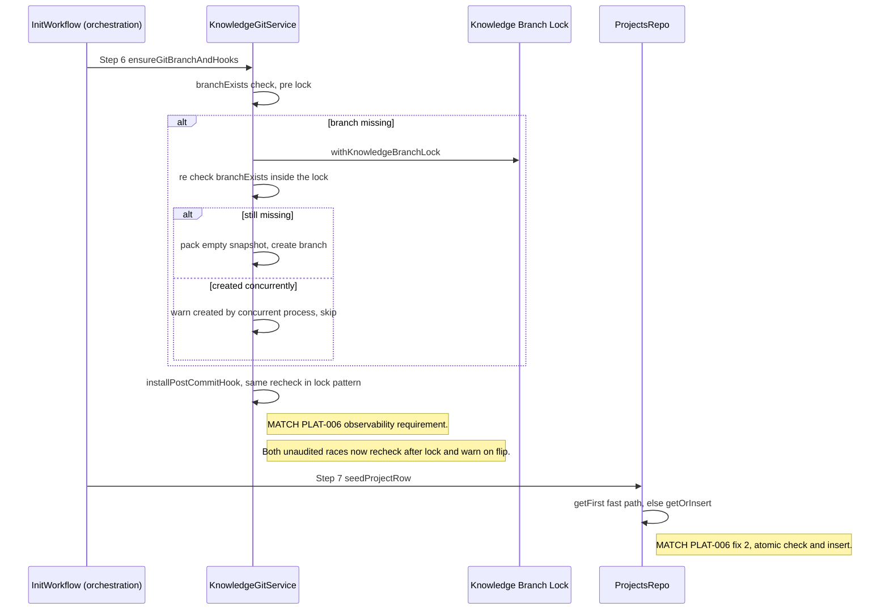
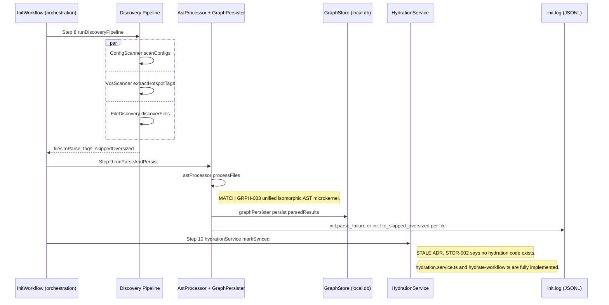
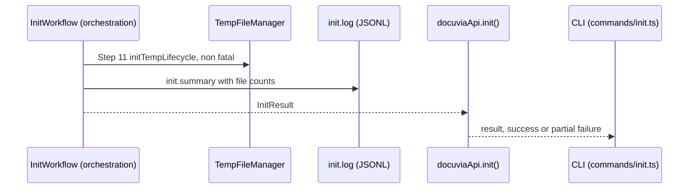
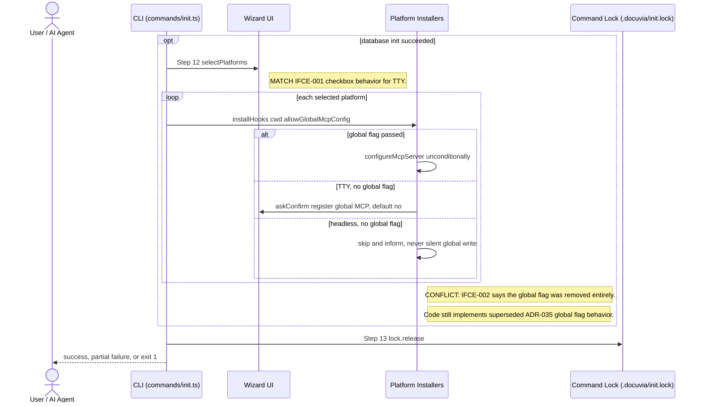

# `init` — Execution Flow vs. Architecture Decisions

> Method: ADR/design context was gathered from `docs/gitbook/adr/**` (the project's curated
> decision graph — `graphify-out/` only contains raw AST/semantic parse caches, not a separate
> readable knowledge graph, so the gitbook ADR tree is the authoritative source here). The actual
> call sequence below was traced directly through the source with GitNexus `query`/`context`/`Read`
> starting from `artifacts/cli/src/commands/init.ts`, not inferred from the ADRs.

This trace walks `docuvia init` from the CLI entry point down through the orchestration
(`InitWorkflow`) and domain-core layers, annotating each step with the ADR that governs it. Steps
are numbered to match the sequence diagram below.

## Sequence Diagram, by Phase

The full flow is one 13-step sequence across 15 collaborators — as a single diagram it renders
too wide to read. It's split below into six panels along `InitWorkflow`'s own phase boundaries
(the numbered phases in its doc comment), each keeping only the participants active in that phase.
Step numbers carry over unchanged, so they still line up with the mapping table and the conflicts
section further down.

### Phase 0 — CLI Entry, Confirmation & Command Lock (steps 1-3)



### Phase 1 — Orchestration Entry & Database Bootstrap (steps 4-5)



### Phase 2 — Knowledge Branch, Hook & Project Row (steps 6-7)



### Phase 3 — Discovery, Parse, Persist & Hydration Mark (steps 8-10)



### Phase 4 — Temp Lifecycle, Summary & Return (step 11)



### Phase 5 — Agent Integrations & Lock Release (steps 12-13)



## Step → ADR Mapping

| #   | Step                                                        | Governing ADR(s)                                                                                                                                                    | Verdict                           |
| --- | ----------------------------------------------------------- | ------------------------------------------------------------------------------------------------------------------------------------------------------------------- | --------------------------------- |
| 1   | Zod boundary validation of CLI input                        | `guidelines/design-spirit.md` #4 (boundary validation)                                                                                                              | ✅ Match                          |
| 2   | TTY confirmation prompt                                     | [IFCE-001](../adr/interface/IFCE-001-wizard-style-interactive-cli.md)                                                                                               | ⚠️ **Conflict** — see below       |
| 3   | Whole-command single-flight lock                            | [PLAT-006](../adr/platform/PLAT-006-init-single-flight-lock.md)                                                                                                     | ✅ Match                          |
| 5   | `openStore()` — WAL + `IMMEDIATE` migration transaction     | [PLAT-006](../adr/platform/PLAT-006-init-single-flight-lock.md), [STOR-002](../adr/storage/STOR-002-sqlite-ephemeral-query-engine.md)                               | ✅ Match                          |
| 6   | `ensureGitBranchAndHooks()` recheck-in-lock + warn          | [PLAT-006](../adr/platform/PLAT-006-init-single-flight-lock.md), [STOR-001](../adr/storage/STOR-001-git-branch-source-of-truth.md) (branch-first-commit stamping)   | ✅ Match                          |
| 7   | `seedProjectRow()` atomic `getOrInsert`                     | [PLAT-006](../adr/platform/PLAT-006-init-single-flight-lock.md)                                                                                                     | ✅ Match                          |
| 8   | Parallel discovery (config/VCS/file scan)                   | — (no ADR governs this directly; implementation detail)                                                                                                             | —                                 |
| 9   | AST parse + persist                                         | [GRPH-003](../adr/graph/GRPH-003-unified-ast-microkernel.md)                                                                                                        | ✅ Match                          |
| 10  | `hydrationService.markSynced()`                             | [STOR-002](../adr/storage/STOR-002-sqlite-ephemeral-query-engine.md)                                                                                                | ⚠️ **ADR text stale** — see below |
| 11  | Temp-file manager init (non-fatal)                          | `architecture/application-lifecycle-and-state.md`                                                                                                                   | ✅ Match                          |
| 12  | Platform selection (checkbox / `--platform` / headless-all) | [IFCE-001](../adr/interface/IFCE-001-wizard-style-interactive-cli.md)                                                                                               | ✅ Match (this part of the ADR)   |
| 12b | `--global` / confirm-default-no / skip-and-inform           | [ADR-035](../adr/legacy/ADR-035-opt-in-global-side-effect-gating.md) (superseded), [IFCE-002](../adr/interface/IFCE-002-strict-repo-scoped-boundaries.md) (current) | ⚠️ **Conflict** — see below       |
| —   | `init.start` / `init.summary` JSONL log                     | [IFCE-003](../adr/interface/IFCE-003-persisted-structured-command-log.md)                                                                                           | ✅ Match                          |
| —   | Hidden `docuvia-knowledge` branch + post-commit hook        | [PLAT-004](../adr/platform/PLAT-004-zero-interruption-invisible-indexing.md)                                                                                        | ✅ Match                          |

## Conflicts Found

### 0. IFCE-002 says the `--global` flag was removed entirely; it's still live

This is the most serious conflict found across the whole `docuvia` command surface, so it's listed
first even though it sits late in `init`'s own flow (step 12b).

[ADR-035](../adr/legacy/ADR-035-opt-in-global-side-effect-gating.md) (2026-07-11) introduced an
opt-in `--global` flag so `init` could register Docuvia's MCP server into the machine-global Claude
Desktop config. That ADR was later explicitly superseded by
[IFCE-002](../adr/interface/IFCE-002-strict-repo-scoped-boundaries.md) (2026-07-12, one day later),
which reverses the decision outright:

> **No Global Flags**: The `--global` flag is completely removed from all commands... **Manual MCP
> Registration**: The CLI will not attempt to edit AI client configurations (like Claude Desktop or
> Cursor). Instead, the CLI or documentation will simply print the necessary JSON snippet and
> instruct the user to copy-paste it manually.

But the code still implements the _superseded_ ADR-035 behavior, not IFCE-002's:

- `artifacts/cli/src/cli.ts:48-51,135-144` still parses `CLI_FLAGS.GLOBAL` for both `init` and
  `uninstall` and passes `allowGlobalMcpConfig` through.
- `artifacts/cli/src/platforms/claude.platform.ts`'s `maybeConfigureMcpServer` still writes
  directly to `claude_desktop_config.json` when the flag (or an interactive confirm) allows it —
  exactly the "CLI edits AI client configs" behavior IFCE-002 says must not happen.

This isn't a documentation nit: IFCE-002 was written specifically because the old behavior has real
failure modes (multi-project key collisions, orphaned global config entries after `docuvia clean`
deletes a project). Those failure modes are still live in the current code. **Recommendation**:
either implement IFCE-002 (remove `--global`, print-and-copy-paste instead) or, if the team decided
IFCE-002 was itself premature, write a new ADR un-superseding it — but the current state, where the
latest-dated accepted ADR contradicts what ships, should not persist silently.

### 1. IFCE-001 requires an `--interactive` flag; the code has none

[IFCE-001](../adr/interface/IFCE-001-wizard-style-interactive-cli.md) states as its first decision
point:

> **Default Non-Interactive**: By default, commands like `docuvia init` execute in a standard,
> headless CLI mode... **Opt-In Interactivity**: The interactive wizard must be explicitly
> triggered via an `--interactive` (or `-i`) flag.

The actual implementation (`artifacts/cli/src/commands/init.ts:113-120`) does not gate on any
`--interactive`/`-i` flag at all:

```ts
if (process.stdin.isTTY) {
  const proceed = await ui.askConfirm(UI_MESSAGES.INIT_CONFIRM, true);
  ...
}
```

This matches [`docs/gitbook/user-guide/cli/init.md`](../user-guide/cli/init.md), which explicitly
documents the divergence: _"There's no `--interactive` flag — `init` prompts for confirmation and
platform selection when stdin is a TTY... and runs straight through with sensible defaults... when
it isn't."_ So the user-facing docs and the code agree with each other — it's the ADR that's out of
date relative to what shipped. `IFCE-001`'s second decision point (the platform-selection checkbox,
step 12) _is_ implemented as described; only the flag-gating mechanism for the confirmation prompt
has drifted from TTY-autodetection instead. **Recommendation**: update IFCE-001 (or file a
superseding ADR) to describe TTY-autodetection as the actual accepted mechanism, since it's already
shipped and documented, rather than leaving the ADR contradicting the implementation it's supposed
to govern.

### 2. STOR-002 claims "no hydration code exists anywhere in the codebase" — no longer true

[STOR-002](../adr/storage/STOR-002-sqlite-ephemeral-query-engine.md)'s "Known implementation gap"
note says:

> as of this writing, no hydration code exists anywhere in the codebase — the JSONL-to-SQLite
> direction described in this ADR has not been built.

But `init`'s own execution flow (step 10) directly touches this exact subsystem — `InitWorkflow`
calls `hydrationService.markSynced()` specifically to avoid tripping the staleness check that a
_fully implemented_ hydration path enforces. Tracing the dependency confirms real, wired-up
implementations exist:

- `lib/core/src/git/hydration.service.ts` — the hydration service itself
- `lib/ui-core/src/workflows/hydrate/hydrate-workflow.ts` — the `docuvia hydrate` command's workflow
- `lib/ui-core/src/utils/ensure-hydrated.ts` — the staleness check every read-path command
  (`query`, `impact`, `status`, `review`) runs before executing
- [`docs/gitbook/user-guide/cli/hydrate.md`](../user-guide/cli/hydrate.md) — user-facing docs for
  the command

**Recommendation**: strike or update STOR-002's "Known implementation gap" note — it's a stale
snapshot from before hydration was built, and leaving it in place risks a future reader (human or
agent) believing the gap still exists and re-implementing something that already ships.

### 3. PLAT-006's command-level lock is CLI-only — the MCP entry point to the same `init` bypasses it entirely

Full detail lives in [mcp-execution-flow.md](mcp-execution-flow.md#conflicts-found), since it's the
MCP tool's own code that skips the lock — but it belongs here too, because it means Phase 0's
"MATCH PLAT-006" note above is only true for the CLI entry point. `artifacts/cli/src/mcp/tools/init.ts`'s
`docuvia_init` tool calls `docuviaApi.init()` directly, never through `initCommand()`, so it never
calls `acquireProcessLock` at all. PLAT-006 (2026-07-14) explicitly justifies the coarse lock by
naming AI-agent/MCP-driven concurrent `init` invocations as the motivating scenario — which makes
this the one entry point most in need of the lock being the one that doesn't have it.

## Non-conflicts worth calling out

Everything else PLAT-006 (2026-07-14, the newest and most detailed ADR touching `init`) describes
as _already shipped_ — the migration `IMMEDIATE` transaction, the `ProjectsRepo.getOrInsert()`
atomic insert, and the recheck-after-lock-plus-warn pattern on both the knowledge-branch creation
and post-commit-hook install races — is faithfully implemented exactly as decided on the CLI path,
including the `writeOrAppend()` fix (distinguishing `ENOENT` from other read errors before treating
a file as absent) that the ADR flagged as a related-but-independent latent bug. The one piece that
is _not_ uniformly implemented is the coarse command-level lock itself once the MCP entry point is
in scope — see Conflict #3 above.
