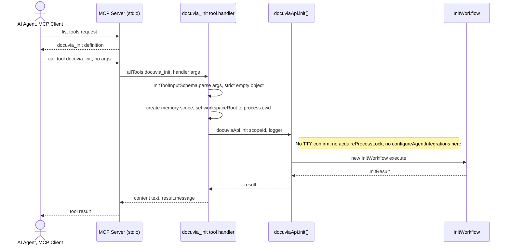

# `mcp` — Execution Flow vs. Architecture Decisions

> Method: ADR context from `docs/gitbook/adr/**`; call sequence traced from
> `artifacts/cli/src/mcp/server.ts` through `artifacts/cli/src/mcp/tools/index.ts` and
> `artifacts/cli/src/mcp/tools/init.ts`.

`docuvia mcp` is a long-running stdio JSON-RPC server — a second Presentation-layer entry point
into the same `docuviaApi` surface the CLI uses, for AI agents that speak MCP instead of shelling
out. As of this trace it exposes exactly **one** tool, `docuvia_init`, not the full command set.

## Sequence Diagram

## Step → ADR Mapping

| Step                                                                    | Governing ADR(s)                                                      | Verdict                                        |
| ----------------------------------------------------------------------- | --------------------------------------------------------------------- | ---------------------------------------------- |
| MCP tool boundary validation (`InitToolInputSchema.parse`)              | `guidelines/design-spirit.md` #4 (boundary validation)                | ✅ Match                                       |
| One `docuviaMemory` scope per call, deleted in `finally`                | `architecture/application-lifecycle-and-state.md`                     | ✅ Match                                       |
| Non-interactive by construction (no TTY concept over stdio)             | [IFCE-001](../adr/interface/IFCE-001-wizard-style-interactive-cli.md) | ✅ Match                                       |
| `docuvia_init` tool skips `initCommand()`'s command-level lock entirely | [PLAT-006](../adr/platform/PLAT-006-init-single-flight-lock.md)       | ⚠️ **Conflict, and a serious one** — see below |

## Conflicts Found

### The MCP `docuvia_init` tool has zero PLAT-006 lock protection — in exactly the scenario PLAT-006 names as the reason it exists

This is the most concrete correctness gap found across this whole documentation pass.
[Init's Phase 0](init-execution-flow.md#phase-0--cli-entry-confirmation--command-lock-steps-1-3)
shows `initCommand()` (`artifacts/cli/src/commands/init.ts`) acquiring the coarse, whole-command
`.docuvia/init.lock` **before** calling `docuviaApi.init()`. But `initTool.handler`
(`artifacts/cli/src/mcp/tools/init.ts:24-43`) calls `docuviaApi.init(scopeId, logger)` **directly**
— it never goes through `initCommand()`, so it never touches `acquireProcessLock` at all.

[PLAT-006](../adr/platform/PLAT-006-init-single-flight-lock.md)'s own "Advice" section explicitly
justifies the coarse lock by naming this exact class of caller as the risk:

> concurrent `init` was judged not to be user error alone but a plausible product-shaped occurrence,
> since Docuvia2's own `init` installs itself into multiple AI-agent/editor integration points
> (`.claude/`, `.cursor/`, MCP config) — **the class of tools most likely to invoke `init`
> programmatically and concurrently.**

The MCP server is precisely that class of caller, and it is the one entry point with no lock at
all. A concrete failure scenario: an AI agent connected over MCP calls `docuvia_init` at the same
moment a human (or another agent) runs `docuvia init` from a terminal in the same workspace — the
CLI path waits politely for the lock; the MCP path barrels straight into `InitWorkflow.execute()`
concurrently, re-exposing the exact races PLAT-006 was written to close (duplicate knowledge-branch
commits, duplicate post-commit hook installs — both still individually guarded by their own
recheck-in-lock logic, so those two specific races are _not_ re-opened — but any future `init` phase
that assumes the coarse lock's serialization, without its own bespoke lock, would be unprotected
specifically on this path).

**Why this matters more than a typical layering nit**: PLAT-006 is dated 2026-07-14, the newest ADR
in the tree, written specifically to close this bug class. Its own justification section names MCP
as the motivating caller. The fact that the one MCP tool that exists today is `docuvia_init` — the
exact command PLAT-006 is about — and that tool doesn't route through the lock, means the ADR's
stated goal is unmet for the caller it was most worried about.

**Recommendation**: either move the `acquireProcessLock` call into `InitWorkflow`/`docuviaApi.init()`
itself (so every Presentation-layer entry point gets it for free, which also simplifies
`initCommand()`), or have `initTool.handler` call the same lock-acquire/release sequence
`initCommand()` does before delegating to `docuviaApi.init()`.
