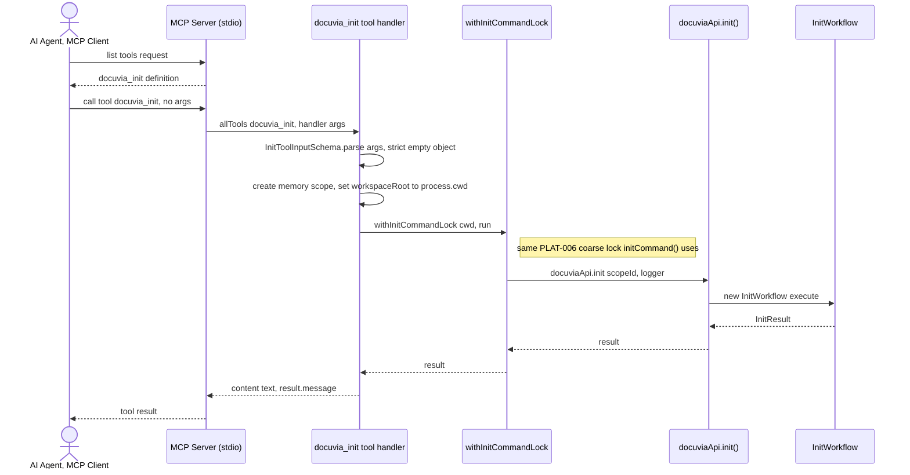

# `mcp` — Execution Flow vs. Architecture Decisions

> Method: ADR context from `docs/gitbook/adr/**`; call sequence traced from
> `artifacts/cli/src/mcp/server.ts` through `artifacts/cli/src/mcp/tools/index.ts` and
> `artifacts/cli/src/mcp/tools/init.ts`.

`docuvia mcp` is a long-running stdio JSON-RPC server — a second Presentation-layer entry point
into the same `docuviaApi` surface the CLI uses, for AI agents that speak MCP instead of shelling
out. As of this trace it exposes exactly **one** tool, `docuvia_init`, not the full command set.

## Sequence Diagram

## Step → ADR Mapping

| Step                                                            | Governing ADR(s)                                                      | Verdict                        |
| --------------------------------------------------------------- | --------------------------------------------------------------------- | ------------------------------ |
| MCP tool boundary validation (`InitToolInputSchema.parse`)      | `guidelines/design-spirit.md` #4 (boundary validation)                | ✅ Match                       |
| One `docuviaMemory` scope per call, deleted in `finally`        | `architecture/application-lifecycle-and-state.md`                     | ✅ Match                       |
| Non-interactive by construction (no TTY concept over stdio)     | [IFCE-001](../adr/interface/IFCE-001-wizard-style-interactive-cli.md) | ✅ Match                       |
| `docuvia_init` tool shares `initCommand()`'s command-level lock | [PLAT-006](../adr/platform/PLAT-006-init-single-flight-lock.md)       | ✅ Match (RESOLVED, see below) |

## Conflicts Found

### The MCP `docuvia_init` tool used to have zero PLAT-006 lock protection (RESOLVED 2026-07-18)

Prior revisions of this doc flagged a real correctness gap: `initTool.handler`
(`artifacts/cli/src/mcp/tools/init.ts`) called `docuviaApi.init(scopeId, logger)` directly, never
going through `initCommand()`'s coarse `.docuvia/init.lock` — exactly the class of caller
[PLAT-006](../adr/platform/PLAT-006-init-single-flight-lock.md)'s own "Advice" section names as the
risk (Docuvia's own agent/editor integrations being "the class of tools most likely to invoke
`init` programmatically and concurrently").

**Fixed**: the lock acquire/release sequence was extracted into a shared
`withInitCommandLock(cwd, fn)` helper (`artifacts/cli/src/utils/init-command-lock.ts`), and both
`initCommand()` (CLI) and `initTool.handler` (MCP) now call through it — the MCP path shown in the
sequence diagram above. A deterministic regression test
(`test/integration/init-cli-mcp-symmetry.test.ts`) holds the lock manually and asserts the MCP
call blocks until release, using real subprocesses (an in-process `Promise.allSettled` race was
tried first and found to pass even without the fix, since same-process async calls around
synchronous `better-sqlite3` work don't interleave mid-critical-section the way separate OS
processes do). No further action needed here.
