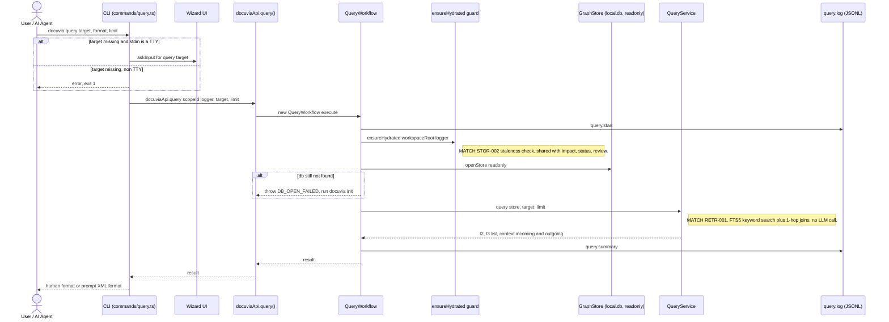

# `query` — Execution Flow vs. Architecture Decisions

> Method: ADR context from `docs/gitbook/adr/**`; call sequence traced from
> `artifacts/cli/src/commands/query.ts` through `lib/ui-core/src/workflows/query/query-workflow.ts`.

`docuvia query` is a local-first, no-LLM natural-language + structural lookup. It shares the
automatic staleness-check hydration guard with `impact`, `status`, and `review`.

## Sequence Diagram

## Step → ADR Mapping

| Step                                                          | Governing ADR(s)                                                            | Verdict              |
| ------------------------------------------------------------- | --------------------------------------------------------------------------- | -------------------- |
| Staleness-check auto-hydrate before read                      | [STOR-002](../adr/storage/STOR-002-sqlite-ephemeral-query-engine.md)        | ✅ Match             |
| FTS5 + 1-hop SQL JOIN, no LLM intent routing                  | [RETR-001](../adr/retrieval/RETR-001-heuristic-keyword-query.md)            | ✅ Match             |
| Query methods on `IGraphNodesRepo`/`IL3NodesRepo`             | [GRPH-005](../adr/graph/GRPH-005-read-side-query-layer.md)                  | ✅ Match             |
| `--format prompt` XML-tagged output for LLM context injection | [RETR-002](../adr/retrieval/RETR-002-context-block-for-prompt-injection.md) | ✅ Match (see below) |
| `query.start` / `query.summary` JSONL log                     | [IFCE-003](../adr/interface/IFCE-003-persisted-structured-command-log.md)   | ✅ Match             |

## Conflicts Found

None found. `query`'s two output formats — human-readable and the `<docuvia_context>` XML block for
`--format prompt` — line up with RETR-001's "no LLM call" constraint and RETR-002's prompt-injection-safe
context-block framing respectively; the implementation in `formatPromptOutput()`
(`artifacts/cli/src/commands/query.ts:14-54`) wraps every field in named XML tags rather than
concatenating raw text, which is exactly the shape RETR-002 exists to require.
