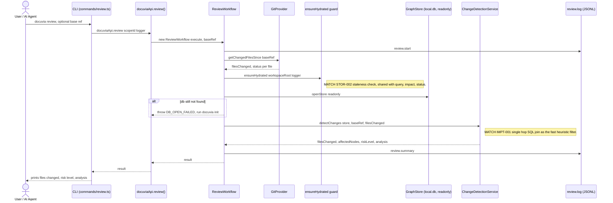

# `review` — Execution Flow vs. Architecture Decisions

> Method: ADR context from `docs/gitbook/adr/**`; call sequence traced from
> `artifacts/cli/src/commands/review.ts` through `lib/ui-core/src/workflows/review/review-workflow.ts`.

`docuvia review` resolves the changed-file set since a base ref, then delegates blast-radius +
risk aggregation to the Domain Core's `IChangeDetectionService`. It shares the automatic
staleness-check hydration guard with `query`, `impact`, and `status`.

## Sequence Diagram

## Step → ADR Mapping

| Step                                                                           | Governing ADR(s)                                                          | Verdict                           |
| ------------------------------------------------------------------------------ | ------------------------------------------------------------------------- | --------------------------------- |
| Staleness-check auto-hydrate before read                                       | [STOR-002](../adr/storage/STOR-002-sqlite-ephemeral-query-engine.md)      | ✅ Match                          |
| Blast-radius via single-hop SQL JOIN (`node_links`) as a fast heuristic filter | [IMPT-001](../adr/impact/IMPT-001-sql-single-hop-blast-radius.md)         | ✅ Match                          |
| LSP escalation for absolute-quality blast radius                               | [IMPT-002](../adr/impact/IMPT-002-lsp-for-absolute-quality.md)            | ✅ Match (transparent, see below) |
| `review.start` / `review.summary` JSONL log                                    | [IFCE-003](../adr/interface/IFCE-003-persisted-structured-command-log.md) | ✅ Match                          |

## Conflicts Found

None. Prior revisions of this doc flagged `review` as having no LSP-escalation path against
[IMPT-002](../adr/impact/IMPT-002-lsp-for-absolute-quality.md)'s tri-layer mandate, on the
assumption that `review` would need its own `escalateToLsp`-style flag the way `impact` does (or
did — see the impact doc; that flag has since been removed). **Re-checked against the actual call
chain**: `ChangeDetectionService.detectChanges()` (which backs `review`) calls
`this.impactService.getBlastRadius(store, file)` — the exact same `ImpactService` method `impact`
itself calls, reading the same `node_links` graph data. [PLAT-007](../adr/platform/PLAT-007-tiered-background-knowledge-evolution.md#tier-b--lsp-escalation-batch---escalate-to-lsp)'s
Tier B batch writes LSP-corrected edges directly into that graph data, not into a
per-command code path — so `review`'s blast radius benefits from Tier B's LSP-precision edges
transparently, exactly the way `impact`'s does, with no command-specific wiring needed on either
side. No gap to close here.
