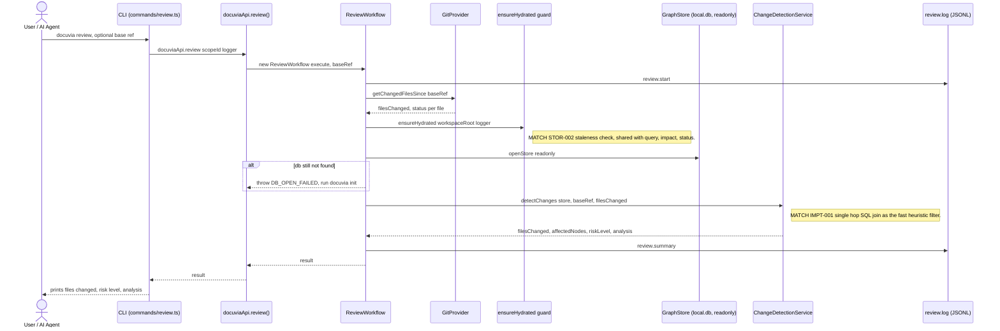

# `review` — Execution Flow vs. Architecture Decisions

> Method: ADR context from `docs/gitbook/adr/**`; call sequence traced from
> `artifacts/cli/src/commands/review.ts` through `lib/ui-core/src/workflows/review/review-workflow.ts`.

`docuvia review` resolves the changed-file set since a base ref, then delegates blast-radius +
risk aggregation to the Domain Core's `IChangeDetectionService`. It shares the automatic
staleness-check hydration guard with `query`, `impact`, and `status`.

## Sequence Diagram

## Step → ADR Mapping

| Step                                                                           | Governing ADR(s)                                                          | Verdict                                   |
| ------------------------------------------------------------------------------ | ------------------------------------------------------------------------- | ----------------------------------------- |
| Staleness-check auto-hydrate before read                                       | [STOR-002](../adr/storage/STOR-002-sqlite-ephemeral-query-engine.md)      | ✅ Match                                  |
| Blast-radius via single-hop SQL JOIN (`node_links`) as a fast heuristic filter | [IMPT-001](../adr/impact/IMPT-001-sql-single-hop-blast-radius.md)         | ✅ Match                                  |
| LSP escalation for absolute-quality blast radius                               | [IMPT-003](../adr/impact/IMPT-002-lsp-for-absolute-quality.md)            | ⚠️ **Not wired for `review`** — see below |
| `review.start` / `review.summary` JSONL log                                    | [IFCE-003](../adr/interface/IFCE-003-persisted-structured-command-log.md) | ✅ Match                                  |

## Conflicts Found

### IMPT-003 mandates LSP escalation; `review` has no such path at all

[IMPT-003](../adr/impact/IMPT-002-lsp-for-absolute-quality.md) (filename says `IMPT-002`, front-matter
`id` says `IMPT-003` — worth reconciling on its own) mandates an **AST + LSP + LLM tri-layer
architecture**, explicitly naming the SQL single-hop pass as only the first, "Speed" layer that
_must_ escalate to a headless LSP for "absolute quality" before results are trusted. `impact.ts`
at least accepts an `escalateToLsp` option (currently a documented no-op — see the impact doc).
`review.ts`/`ReviewWorkflow` has no `escalateToLsp` parameter or LSP path anywhere in its call
chain — `detectChanges()` only ever runs the SQL single-hop filter IMPT-001 describes as the
_preliminary_ pass. Since `review` is exactly the kind of "is this safe to merge" call IMPT-003
says the SQL-only pass "must not be used as the final word" for, this is a real gap, not just an
unimplemented flag: **`review`'s risk level is currently always IMPT-001-only, with no path to the
LSP-verified accuracy IMPT-003 requires for it to be trustworthy for automated decisions.**
**Recommendation**: either extend `review` with the same (currently no-op) `escalateToLsp` opt-in
`impact` has, or scope IMPT-003 explicitly to `impact` only if `review` was never meant to be
covered by it.
