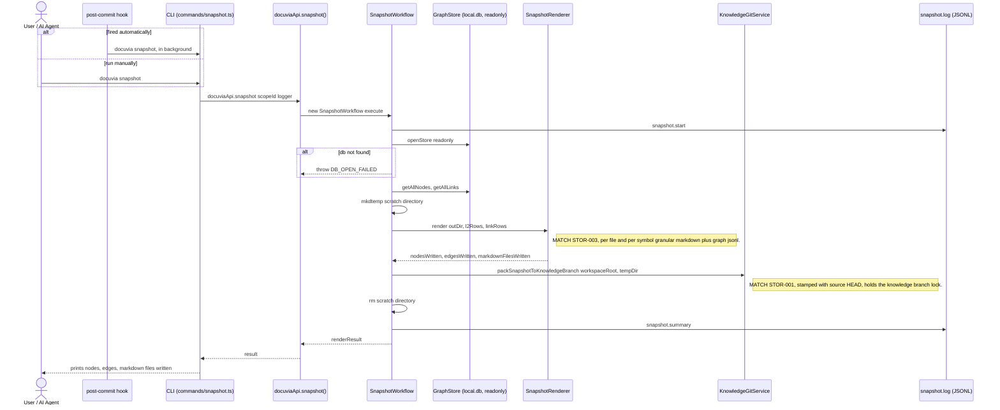

# `snapshot` — Execution Flow vs. Architecture Decisions

> Method: ADR context from `docs/gitbook/adr/**`; call sequence traced from
> `artifacts/cli/src/commands/snapshot.ts` through `lib/ui-core/src/workflows/snapshot/snapshot-workflow.ts`.

`docuvia snapshot` re-renders the current SQLite graph into the git-native `docuvia-knowledge`
branch view. It deliberately does **not** re-run file discovery or AST parsing — that data is
assumed already persisted by `init`/`sync`. This is also the command the post-commit hook installed
by `init` (PLAT-004) fires automatically after every commit.

## Sequence Diagram

## Step → ADR Mapping

| Step                                                                                      | Governing ADR(s)                                                             | Verdict  |
| ----------------------------------------------------------------------------------------- | ---------------------------------------------------------------------------- | -------- |
| Fired automatically by the `post-commit` hook                                             | [PLAT-004](../adr/platform/PLAT-004-zero-interruption-invisible-indexing.md) | ✅ Match |
| Renders into granular per-file/per-symbol markdown + `graph/*.jsonl`                      | [STOR-003](../adr/storage/STOR-003-jsonl-granular-markdown-format.md)        | ✅ Match |
| Packs onto `docuvia-knowledge`, stamped with source HEAD, under the knowledge-branch lock | [STOR-001](../adr/storage/STOR-001-git-branch-source-of-truth.md)            | ✅ Match |
| Reuses the same bulk-read methods as `export-topology`                                    | [GRPH-005](../adr/graph/GRPH-005-read-side-query-layer.md)                   | ✅ Match |
| `snapshot.start` / `snapshot.summary` JSONL log                                           | [IFCE-003](../adr/interface/IFCE-003-persisted-structured-command-log.md)    | ✅ Match |

## Conflicts Found

None found. `snapshot` is the cleanest command traced so far — every step lines up with an accepted
ADR, and it correctly reuses the same knowledge-branch locking primitives `init`'s
`ensureGitBranchAndHooks` phase depends on (see [init's Phase 2](init-execution-flow.md)), rather
than a separate, divergent implementation.
