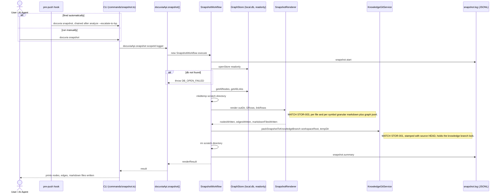

# `snapshot` — Execution Flow vs. Architecture Decisions

> Method: ADR context from `docs/gitbook/adr/**`; call sequence traced from
> `artifacts/cli/src/commands/snapshot.ts` through `lib/ui-core/src/workflows/snapshot/snapshot-workflow.ts`.

`docuvia snapshot` re-renders the current SQLite graph into the git-native `docuvia-knowledge`
branch view. It deliberately does **not** re-run file discovery or AST parsing — that data is
assumed already persisted by `init`/`sync`.

> **Corrected**: this doc previously claimed the post-commit hook installed by `init` fires this
> command automatically after every commit. That was true before PLAT-007 Tier A's post-commit
> hook flip (`knowledge-git.service.ts`'s `installPostCommitHook` doc comment: "flipped from
> `docuvia snapshot` in Slice 2 dispatch 2b") — the post-commit hook now fires `docuvia analyze`
> instead (see [analyze-execution-flow.md](analyze-execution-flow.md)), which only ever updates
> `local.db`, not this branch. `snapshot` is chained inside the **pre-push** hook instead
> (`docuvia analyze --escalate-to-lsp && docuvia snapshot && docuvia sync-knowledge`), so the
> knowledge branch normally only gets real content at push time. `init` and `analyze` auto mode's
> full-ingestion branch (empty graph) are the two exceptions: since 2026-07-28 both call this
> same render/pack core directly and inline (via the shared `packCurrentGraphOntoKnowledgeBranch`
> helper, non-fatal) right after ingesting, rather than leaving the branch's first commit empty
> until the next push or manual `docuvia snapshot` — see
> [init-execution-flow.md](init-execution-flow.md)'s step 11 and
> [analyze-execution-flow.md](analyze-execution-flow.md)'s Mode A full-ingestion branch.

## Sequence Diagram

## Step → ADR Mapping

| Step                                                                                      | Governing ADR(s)                                                                                                             | Verdict  |
| ----------------------------------------------------------------------------------------- | ---------------------------------------------------------------------------------------------------------------------------- | -------- |
| Fired automatically by the `pre-push` hook (chained after `analyze --escalate-to-lsp`)    | [PLAT-007](../adr/platform/PLAT-007-tiered-background-knowledge-evolution.md#tier-b--lsp-escalation-batch---escalate-to-lsp) | ✅ Match |
| Renders into granular per-file/per-symbol markdown + `graph/*.jsonl`                      | [STOR-003](../adr/storage/STOR-003-jsonl-granular-markdown-format.md)                                                        | ✅ Match |
| Packs onto `docuvia-knowledge`, stamped with source HEAD, under the knowledge-branch lock | [STOR-001](../adr/storage/STOR-001-git-branch-source-of-truth.md)                                                            | ✅ Match |
| Reuses the same bulk-read methods as `export-topology`                                    | [GRPH-005](../adr/graph/GRPH-005-read-side-query-layer.md)                                                                   | ✅ Match |
| `snapshot.start` / `snapshot.summary` JSONL log                                           | [IFCE-003](../adr/interface/IFCE-003-persisted-structured-command-log.md)                                                    | ✅ Match |

## Conflicts Found

### 0. This doc's own "fired by the post-commit hook" claim was stale (RESOLVED, see the note above)

The command's own internals were always correct — every step here lines up with an accepted ADR,
and it correctly reuses the same knowledge-branch locking primitives `init`'s
`ensureGitBranchAndHooks` phase depends on (see [init's Phase 2](init-execution-flow.md)), rather
than a separate, divergent implementation. What was wrong was this doc's description of _who calls
it_: it named the post-commit hook, which was true before PLAT-007 Tier A's hook flip but not
after. Corrected above; no code change needed here.
