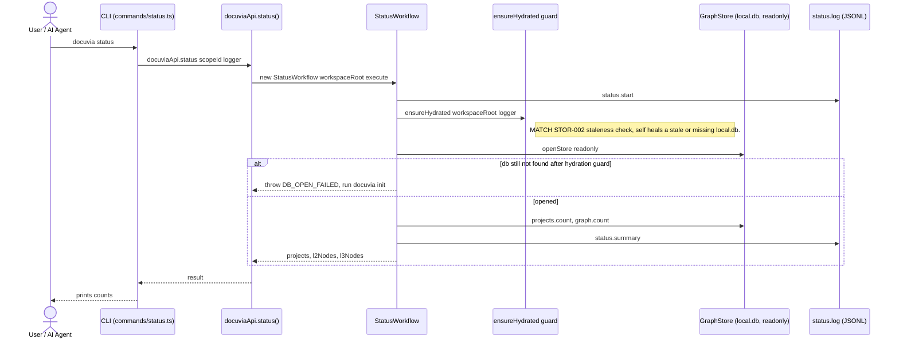

# `status` — Execution Flow vs. Architecture Decisions

> Method: ADR context from `docs/gitbook/adr/**`; call sequence traced from
> `artifacts/cli/src/commands/status.ts` through `lib/ui-core/src/workflows/status/status-workflow.ts`.

`docuvia status` is a read-only health check: row counts for `projects`, `l2_nodes`, `l3_nodes`.
It shares its opening move — the automatic staleness-check hydration guard — with `query`, `impact`,
and `review`; see those docs for the same block.

## Sequence Diagram

## Step → ADR Mapping

| Step                                                  | Governing ADR(s)                                                          | Verdict  |
| ----------------------------------------------------- | ------------------------------------------------------------------------- | -------- |
| Staleness-check auto-hydrate before read              | [STOR-002](../adr/storage/STOR-002-sqlite-ephemeral-query-engine.md)      | ✅ Match |
| Row counts read via `IGraphNodesRepo`/`IProjectsRepo` | [GRPH-005](../adr/graph/GRPH-005-read-side-query-layer.md)                | ✅ Match |
| `status.start` / `status.summary` JSONL log           | [IFCE-003](../adr/interface/IFCE-003-persisted-structured-command-log.md) | ✅ Match |

## Conflicts Found

None found for `status`. It's the simplest of the read-path commands and matches every ADR it
touches.
