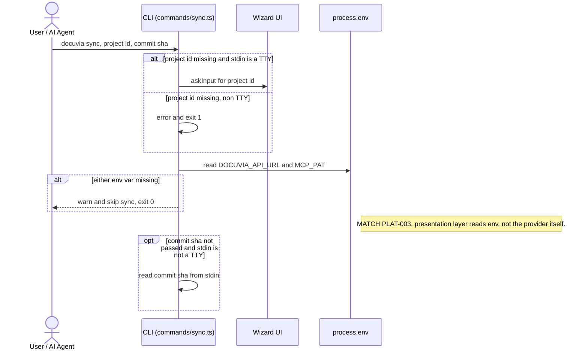
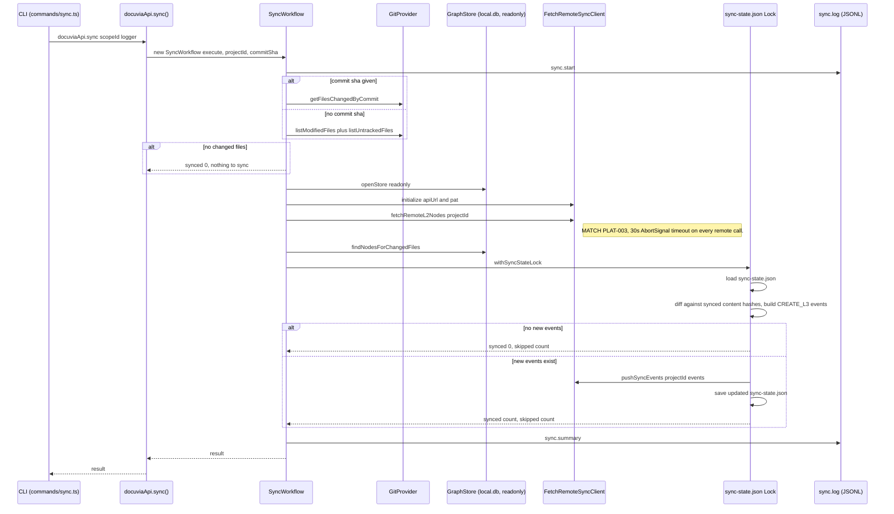

# `sync` — Execution Flow vs. Architecture Decisions

> Method: ADR context from `docs/gitbook/adr/**`; call sequence traced from
> `artifacts/cli/src/commands/sync.ts` through `lib/ui-core/src/workflows/sync/sync-workflow.ts`
> and `lib/remote-api/src/fetch-remote-sync-client.ts`.

`docuvia sync` pushes locally-generated L3 decisions for a set of changed files to the remote
Docuvia backend. It's split into two panels: resolving inputs at the CLI boundary, then the
transactional push itself.

## Phase 0 — Resolve Project ID, Env & Changed-File Set

## Phase 1 — Changed Files, Store Lookup & Locked Push

## Step → ADR Mapping

| Step                                                                                     | Governing ADR(s)                                                                                          | Verdict                                                                                                           |
| ---------------------------------------------------------------------------------------- | --------------------------------------------------------------------------------------------------------- | ----------------------------------------------------------------------------------------------------------------- |
| Remote client: 30s timeout, wrapped errors, config via `docuviaMemory` not `process.env` | [PLAT-003](../adr/platform/PLAT-003-remote-sync-technology-provider.md)                                   | ✅ Match — timeout verified at `lib/remote-api/src/fetch-remote-sync-client.ts:11` (`REQUEST_TIMEOUT_MS = 30000`) |
| CLI (presentation layer) reads `DOCUVIA_API_URL`/`MCP_PAT` from `process.env`            | `architecture/application-lifecycle-and-state.md` ("only the Presentation layer may touch `process.env`") | ✅ Match                                                                                                          |
| Content-hash dedup against `sync-state.json` under a lock                                | — (no dedicated ADR; local implementation detail)                                                         | —                                                                                                                 |
| `sync.start` / `sync.summary` JSONL log                                                  | [IFCE-003](../adr/interface/IFCE-003-persisted-structured-command-log.md)                                 | ✅ Match                                                                                                          |

## Conflicts Found

None found. `sync` is the one command that talks to an external service, and it matches PLAT-003's
template exactly, including the specific 30-second timeout value the ADR prescribes.
