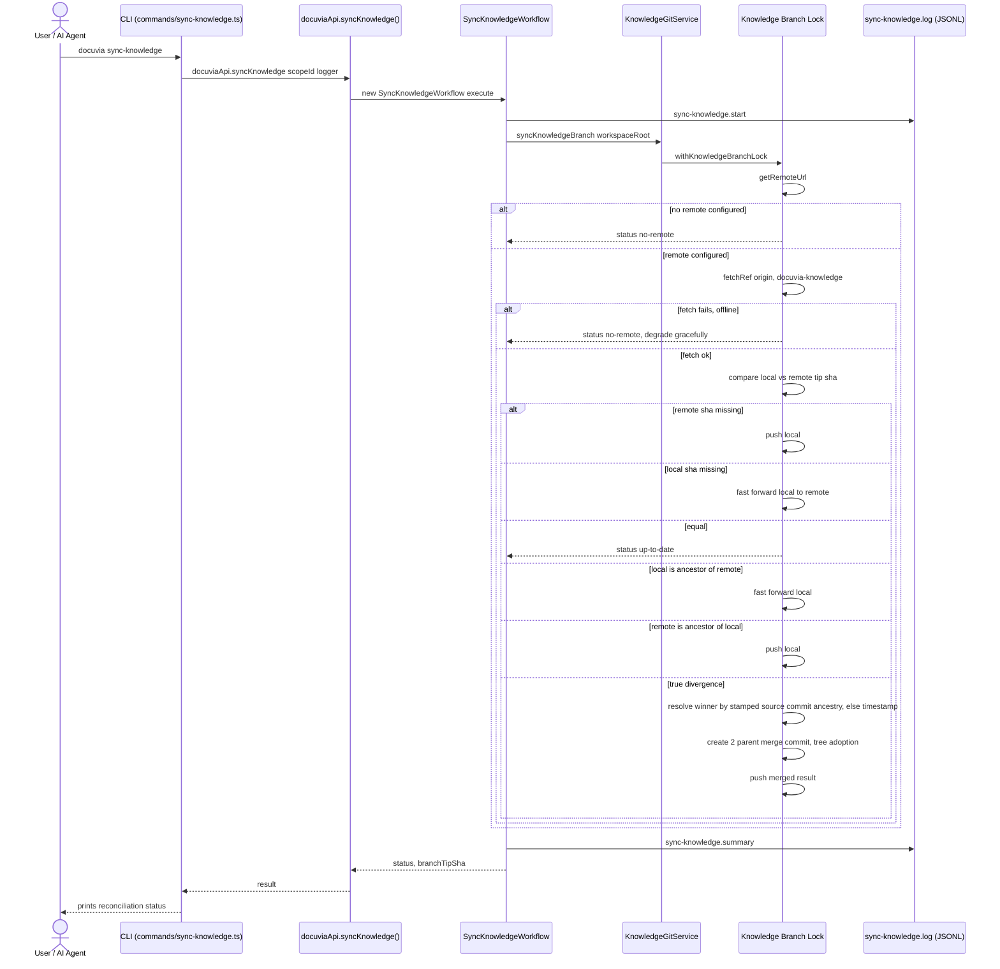

# `sync-knowledge` — Execution Flow vs. Architecture Decisions

> Method: ADR context from `docs/gitbook/adr/**`; call sequence traced from
> `artifacts/cli/src/commands/sync-knowledge.ts` through
> `lib/ui-core/src/workflows/sync-knowledge/sync-knowledge-workflow.ts` and
> `lib/core/src/git/knowledge-git.service.ts`'s `reconcile()`.

`docuvia sync-knowledge` is the explicit, user-triggerable entry point for cross-clone
reconciliation of the `docuvia-knowledge` branch against `origin`. Purely a git operation — it never
opens `local.db`. Deliberately **not** auto-wired into the post-commit hook, since it's a network
call and firing it on every local commit would contradict the "zero-interruption" promise the hook
otherwise keeps.

## Sequence Diagram

## Step → ADR Mapping

| Step                                                                                        | Governing ADR(s)                                                                                              | Verdict                                                             |
| ------------------------------------------------------------------------------------------- | ------------------------------------------------------------------------------------------------------------- | ------------------------------------------------------------------- |
| Cross-clone reconciliation of the knowledge branch                                          | [STOR-001](../adr/storage/STOR-001-git-branch-source-of-truth.md) point 3                                     | ✅ Match                                                            |
| Divergence resolved by tree-adoption merge, winner picked by stamped source-commit ancestry | [STOR-001](../adr/storage/STOR-001-git-branch-source-of-truth.md) point 3, point 4 (`Docuvia-Source` trailer) | ✅ Match                                                            |
| Offline / no-remote degrades gracefully rather than failing                                 | `architecture/error-handling-architecture.md`                                                                 | ✅ Match                                                            |
| Not auto-wired into the post-commit hook                                                    | [PLAT-004](../adr/platform/PLAT-004-zero-interruption-invisible-indexing.md) ("zero-interruption")            | ✅ Match — deliberate, documented in the workflow's own doc comment |
| `sync-knowledge.start` / `.summary` JSONL log                                               | [IFCE-003](../adr/interface/IFCE-003-persisted-structured-command-log.md)                                     | ✅ Match                                                            |

## Conflicts Found

None found. This is the one command whose own doc comment pre-empts the most likely objection (“why
isn't this automatic like `snapshot`?”) with a direct architectural reason, and that reason lines up
exactly with PLAT-004's zero-interruption goal rather than contradicting it.
