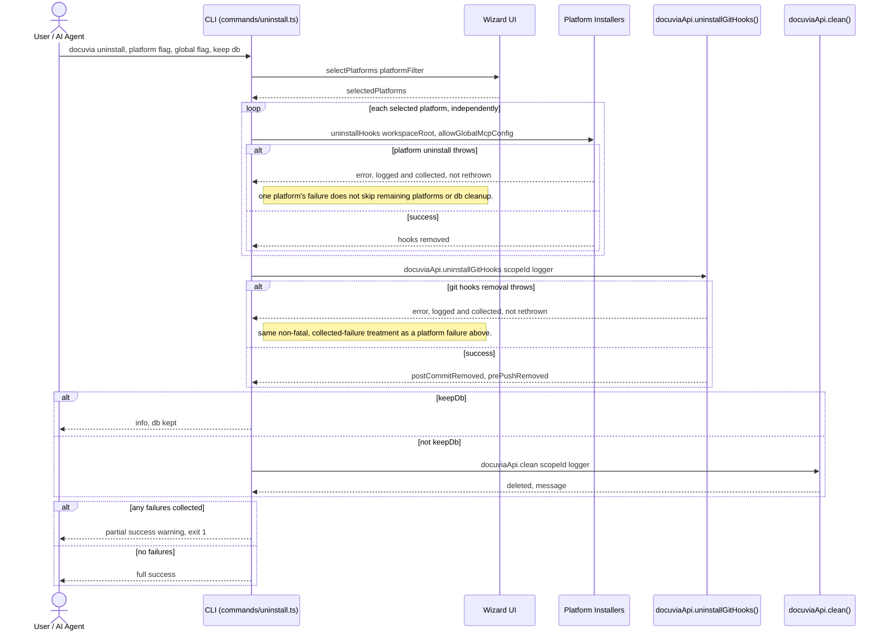

# `uninstall` — Execution Flow vs. Architecture Decisions

> Method: ADR context from `docs/gitbook/adr/**`; call sequence traced from
> `artifacts/cli/src/commands/uninstall.ts`, which calls platform `uninstallHooks()` methods
> directly, `docuviaApi.uninstallGitHooks()` for the git hooks half, and `docuviaApi.clean()` for
> the database half.

> **Status update (Slice 5, §10a):** `uninstall` now also actively removes both git hooks `init`
> installs (the Tier A post-commit hook and the Tier B pre-push hook) via
> `docuviaApi.uninstallGitHooks()` -> `UninstallHooksWorkflow` -> `IKnowledgeGitService`'s
> `removePostCommitHook`/`removePrePushHook`. Previously an uninstalled Docuvia left a hook that
> still fired and silently no-op'd (`npx --no-install` unable to resolve) — the exact invisible
> failure PLAT-007 forbids, and one `uninstall` itself caused.

`docuvia uninstall` reverses what `init` installed: per-platform hooks/rules/MCP config, the git
hooks `init` installs, and (unless `--keep-db`) the local database. It has no dedicated
Orchestration-layer workflow of its own for the per-platform hooks half — it calls each platform's
`uninstallHooks()` directly — but the git hooks half goes through `UninstallHooksWorkflow`, per
this slice's decision to fold every new hook-related check/mutation into the Orchestration layer.

## Sequence Diagram

## Step → ADR Mapping

| Step                                                                                                     | Governing ADR(s)                                                       | Verdict                     |
| -------------------------------------------------------------------------------------------------------- | ---------------------------------------------------------------------- | --------------------------- |
| Each platform uninstalled independently; one failure doesn't block the rest or DB cleanup                | `architecture/error-handling-architecture.md`                          | ✅ Match                    |
| Git hooks removed via `UninstallHooksWorkflow`; one hook's failure doesn't block the other or DB cleanup | `phase1-decision-integration.md` §10a                                  | ✅ Match                    |
| DB cleanup reuses `docuviaApi.clean()` rather than duplicating delete logic                              | [STOR-002](../adr/storage/STOR-002-sqlite-ephemeral-query-engine.md)   | ✅ Match                    |
| `--global` / `allowGlobalMcpConfig` passed through to platform uninstall                                 | [IFCE-002](../adr/interface/IFCE-002-strict-repo-scoped-boundaries.md) | ⚠️ **Conflict** — see below |

## Conflicts Found

### Same IFCE-002 conflict as `init`, on the uninstall side

[init's Conflict #0](init-execution-flow.md#conflicts-found) documents that
[IFCE-002](../adr/interface/IFCE-002-strict-repo-scoped-boundaries.md) supersedes ADR-035 and says
the `--global` flag was **removed entirely** from all commands. `uninstall.ts` is the second half of
that same live contradiction: `uninstallCommand()` still accepts `allowGlobalMcpConfig` and passes it
straight through to `platform.uninstallHooks()`, which (per `claude.platform.ts`) still edits
`claude_desktop_config.json` directly when the flag is set — exactly the "CLI edits AI client
configs" behavior IFCE-002 prohibits. This isn't a second independent bug; it's the same
un-migrated decision showing up on both ends of the same feature (`init` installs the global entry,
`uninstall` removes it) — fixing IFCE-002's implementation gap on the `init` side necessarily means
fixing it here too, since both call sites share `claude.platform.ts`'s `maybeConfigureMcpServer`
family of methods.
