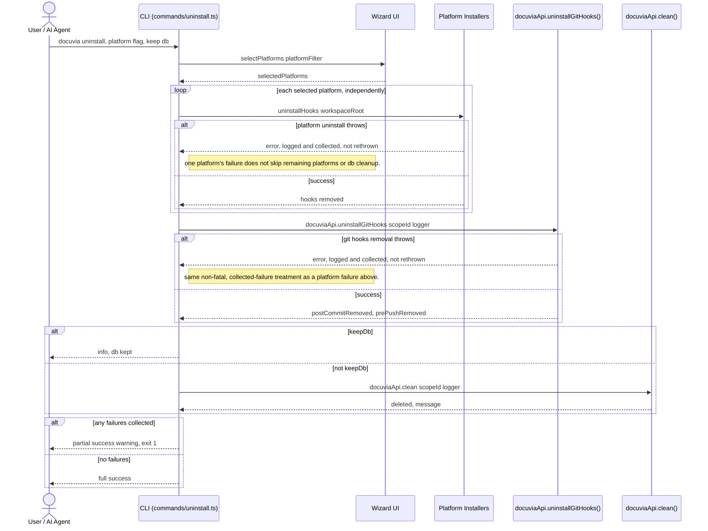

# `uninstall` — Execution Flow vs. Architecture Decisions

> Method: ADR context from `docs/gitbook/adr/**`; call sequence traced from
> `artifacts/cli/src/commands/uninstall.ts`, which calls platform `uninstallHooks()` methods
> directly, `docuviaApi.uninstallGitHooks()` for the git hooks half, and `docuviaApi.clean()` for
> the database half.

> **Status update (Slice 5, §10a):** `uninstall` now also actively removes both git hooks `init`
> installs (the Tier A post-commit hook and the Tier B pre-push hook) via
> `docuviaApi.uninstallGitHooks()` -> `UninstallHooksWorkflow` -> `IKnowledgeGitService`'s
> `removePostCommitHook`/`removePrePushHook`. Previously an uninstalled Docuvia left a hook that
> still fired and silently no-op'd (`npx --no-install` unable to resolve) — the exact invisible
> failure PLAT-007 forbids, and one `uninstall` itself caused.

`docuvia uninstall` reverses what `init` installed: per-platform hooks/rules/MCP config, the git
hooks `init` installs, and (unless `--keep-db`) the local database. It has no dedicated
Orchestration-layer workflow of its own for the per-platform hooks half — it calls each platform's
`uninstallHooks()` directly — but the git hooks half goes through `UninstallHooksWorkflow`, per
this slice's decision to fold every new hook-related check/mutation into the Orchestration layer.

## Sequence Diagram

## Step → ADR Mapping

| Step                                                                                                     | Governing ADR(s)                                                       | Verdict                        |
| -------------------------------------------------------------------------------------------------------- | ---------------------------------------------------------------------- | ------------------------------ |
| Each platform uninstalled independently; one failure doesn't block the rest or DB cleanup                | `architecture/error-handling-architecture.md`                          | ✅ Match                       |
| Git hooks removed via `UninstallHooksWorkflow`; one hook's failure doesn't block the other or DB cleanup | `phase1-decision-integration.md` §10a                                  | ✅ Match                       |
| DB cleanup reuses `docuviaApi.clean()` rather than duplicating delete logic                              | [STOR-002](../adr/storage/STOR-002-sqlite-ephemeral-query-engine.md)   | ✅ Match                       |
| No `--global` flag; platform uninstall never takes one                                                   | [IFCE-002](../adr/interface/IFCE-002-strict-repo-scoped-boundaries.md) | ✅ Match (RESOLVED, see below) |

## Conflicts Found

### Same IFCE-002 conflict as `init`, on the uninstall side (RESOLVED)

This conflict has been resolved — see [init's Conflict #0](init-execution-flow.md#conflicts-found)
for the full fix. `uninstallCommand()` no longer accepts or threads `allowGlobalMcpConfig`; it calls
`platform.uninstallHooks(workspaceRoot)` with no second argument, matching the now-single-parameter
`IIntegrationManager` contract. `claude.platform.ts`'s `uninstallHooks` still best-effort removes a
legacy global MCP entry if one exists (read-then-delete, never a write) — a deliberate exception to
clean up repos set up under an older Docuvia version, not a re-introduction of the removed flag.
