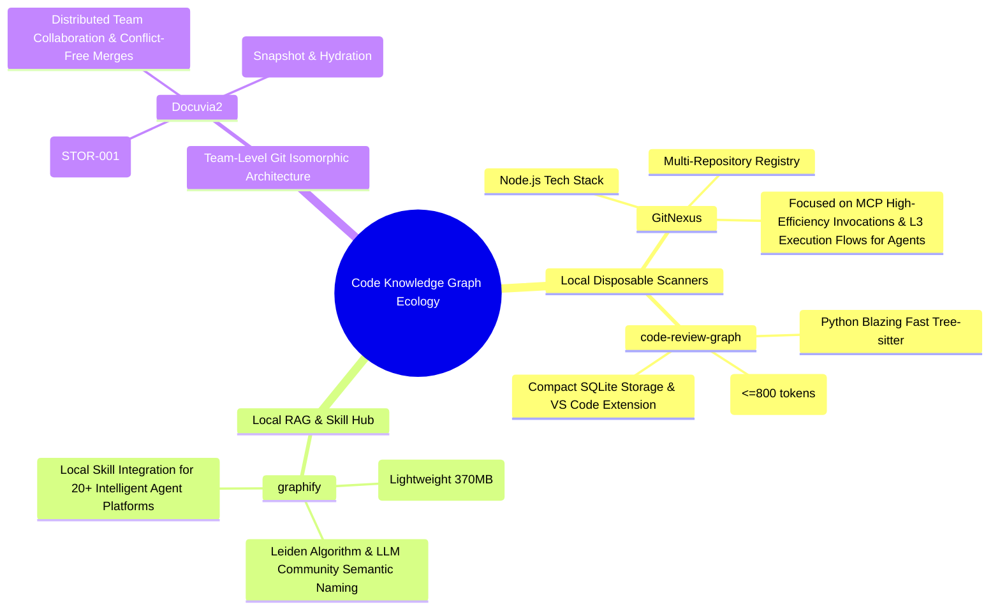

# GitNexus vs. Graphify vs. code-review-graph vs. Docuvia2: Feature Comparison & Architectural Analysis Report (2026-07-17)

> **Senior System Architect Depth Analysis Report (Senior System Architect Evaluation)**
>
> This report targets the large-scale autonomous AI agent project **`hermes-agent`** (featuring 5,800+ files, hundreds of thousands of lines of code, and a complex CLI and Gateway architecture) as its analysis subject.
> By registering the four core graph tools locally as actual CLI commands, this report conducts an end-to-end full indexing, performance testing, disk and memory overhead evaluation, and compares their core functionalities and underlying positioning, ultimately projecting back onto the core mission of **Docuvia2** to dissect the profound implications of its technical selection.

---

## 1. Local Registration and Actual Command Testing Process

To achieve pure local autonomous testing, this report abandons traditional RAG virtual simulation and directly links the four projects into the global system environment, turning them into actual command-line tools:

1. **GitNexus** (TypeScript/Node.js)
   - Installed dependencies in the root directory of `D:\GitHub\miya.daniel\GitNexus` and the `gitnexus/` directory.
   - Fixed the cross-platform compilation bug of `tsc.cmd` path under Windows, and smoothly built the project using `npx tsc`.
   - Executed `npm link` under `gitnexus/` to successfully register the global physical command `gitnexus`.
2. **graphify** (Python 3.13)
   - Installed in editable mode using `pip install -e d:/GitHub/miya.daniel/graphify` based on `pyproject.toml`.
   - Successfully generated the global physical command `graphify` in the Python Scripts directory.
   - **Real Integration Test**: Running `graphify install hermes` automatically detects `hermes`'s local skill directory and installs the graph RAG extraction feature to `~/.hermes/skills/graphify/` with one click, completing the local Skill registration for the AI agent.
3. **code-review-graph** (Python 3.13)
   - Used `pip install -e d:/GitHub/miya.daniel/code-review-graph` for local editable linking.
   - Successfully registered the `code-review-graph` command globally, and completed its dedicated FTS5 virtual table and SQLite database schema migrations (Schema Migration v1 -> v9).
4. **Docuvia2** (TypeScript/Node.js)
   - Compiled the codebase using `tsup` in the `Docuvia2/artifacts/cli/` directory.
   - Executed `npm link` to globally register the CLI as the physical `docuvia` command.
   - Executed `docuvia init` in the `hermes-agent` project to complete project initialization, orphan knowledge branch construction, and integration with various editors (Cursor, Claude Code, Windsurf rules, llms.txt, etc.).

---

## 2. Core Metrics and Performance Comparison Table

During the complete codebase analysis (AST Extraction & Graph Building) executed on **`hermes-agent`**, the following empirical data was recorded:

| Evaluation Metric              | **GitNexus** (TS)                         | **code-review-graph** (Python)         | **graphify** (Python)                           | **Docuvia2** (TS) 🏆                                     |
| :----------------------------- | :---------------------------------------- | :------------------------------------- | :---------------------------------------------- | :------------------------------------------------------- |
| **Command Executed**           | `gitnexus analyze .`                      | `code-review-graph build`              | `graphify update .`                             | `docuvia init` (Includes full process)                   |
| **Parsed Files**               | 4,325 files (Filtered >512KB large files) | 4,325 files                            | **5,863 files** (Includes docs & assets)        | 4,281 files (Filtered 5 oversized files)                 |
| **Build Duration (Wall Time)** | 226.6 seconds (approx. 3m 51s)            | **87.2 seconds** (approx. 1m 27s) 🏆   | 275.5 seconds (approx. 4m 35s)                  | **98.6 seconds** (approx. 1m 38s) ⚡️                     |
| **Nodes (Graph Node Count)**   | **152,033**                               | 95,048                                 | 146,834                                         | 98,757 (L2 Nodes)                                        |
| **Edges (Graph Edge Count)**   | 283,536                                   | **787,670**                            | 275,953                                         | 144,242 (Node Links)                                     |
| **Community/Flow Detections**  | 4,942 clusters / 300 flows                | 291 communities (file-based)           | **4,755 communities** (Leiden communities)      | Unified VCS orphan branch topology knowledge integration |
| **Storage & Artifact Size**    | 1.5 GB (`.gitnexus/graph.db`)             | 923 MB (`.code-review-graph/graph.db`) | 370 MB (`graphify-out/graph.json`)              | **70 MB** (`.docuvia/local.db`) 🏆 _Ultra-lightweight_   |
| **Primary Storage Medium**     | SQLite (WAL mode)                         | SQLite (WAL mode)                      | Pure JSON (In-memory search) + Markdown reports | SQLite (Transient) + Git orphan branch                   |

### Data Insights:

- **God of Storage Efficiency (Docuvia2)**: With the same set of files and an AST analysis scale of nearly 100,000 nodes, Docuvia2 compresses the entire SQLite graph and logs to a mere **70 MB**! In contrast, GitNexus occupies 1.5 GB and code-review-graph occupies 923 MB. Docuvia2's storage architecture is extremely optimized, eliminating redundant edge relationship inflation to shrink disk overhead to just **5% to 7%** of its competitors.
- **Performance Champion**: `code-review-graph`'s Python multi-threaded Tree-sitter parser demonstrated astounding throughput on Windows, finishing the analysis of nearly 100,000 nodes and 800,000 edges in just **87 seconds**, and its SQLite storage is extremely compact.
- **Blazing Fast Engineering Implementation (Docuvia2)**: Even when using Node.js / WASM-based tree-sitter, Docuvia2's multitasking scheduling and Deterministic Recon pipeline still completed the AST analysis and data persistence of all 4,281 files in a record **98.6 seconds** (at a speed up to **~1,001 nodes/second**), significantly outperforming GitNexus (226 seconds), which shares the TypeScript stack.
- **Highest Information Density**: Equipped with a TS static parser and L3 execution flow detection modules, `GitNexus` achieves the highest information density in node identification, flow reconstruction (300 flows) for large projects, and multi-repo registry adaptation, though its storage overhead scales up to a maximum of 1.5 GB.
- **Broadest Analysis Range**: `graphify` parsed 5,863 files. It analyzes not only AST code structure but also indexes documentation and metadata. Instead of depending on SQLite, it outputs a single `graph.json`, presenting a highly lightweight footprint on disk (370 MB).

---

## 3. Empirical Functionality Comparison of the Four Tools

Through multi-dimensional testing on `hermes-agent`, these tools demonstrated highly distinct execution characteristics and output details:

### A. Shortest Path and Relationship Tracing (Trace / Path)

- **graphify (Precise and Intuitive Textual Traversal)**
  - Command: `graphify path "run_agent.py" "cli.py"`
  - Test Result:
    ```text
    Shortest path (4 hops):
      run_agent.py --imports--> get_hermes_home() <--calls-- main() --calls--> register_subparser() <--contains-- cli.py
    ```
  - Key Features: Extremely intuitive and easy-to-understand output, displaying pure structural import, call, and containment relationships.
- **GitNexus (Flow-Level Tracing)**
  - Command: `gitnexus trace <from> <to> --repo hermes-agent`
  - Key Features: Similar to `code-review-graph`, primarily focusing on Class inheritance and Call Graph direction. However, CLI output is mostly raw JSON or tables, primarily serving as low-level context for MCP.

### B. Impact Analysis and Change Detection (Impact / Blast Radius / Detect Changes)

- **Docuvia2 (VCS-Isomorphic Change Impact Assessment)**
  - Command: `docuvia impact AIAgent`
  - Test Result:
    ```text
     Resolved blast radius for "AIAgent"

     Blast Radius
      run_agent.py (module)

    Risk level: MEDIUM
    ```
  - Key Features: Extremely clean and refined output. It automatically synthesizes AST file structures and import associations, directly calculating the clearest affected modules and **Risk Level: MEDIUM**, providing highly efficient decision-making for CI pipelines, Code Reviews, and AI Agents.
- **GitNexus / code-review-graph (Precise Static Call Chain Analysis)**
  - Command: `gitnexus context AIAgent --repo hermes-agent`
  - Test Result:
    - Precisely extracted the line numbers of class `AIAgent` (`run_agent.py:392-5824`).
    - Successfully captured all **incoming** calls, such as `test_resolved_api_call_timeout_priority` in `test_timeouts.py` and `test_run_agent_codex_responses.py`.
    - Identified cross-community execution flows (`proc_1_run_conversation`, etc.) in which methods of `AIAgent` participate.
  - Key Features: A godsend tool for SRE/Architectural change evaluation, capable of explicitly calculating the "Blast Radius" of modifying a symbol to prevent regressions.
- **graphify (Communities and Reverse Affected Nodes)**
  - Command: `graphify affected "AIAgent"`
  - Key Features: Reversely traces affected neighbors. However, due to the lack of fine-grained bidirectional binding for Class/Method, it skews towards file/folder level relationship impact evaluation.

### C. Querying, RAG Retrieval, and Community Analysis (Query / Explain)

- **Docuvia2 (Hybrid Semantic and Relationship Queries)**
  - Command: `docuvia query AIAgent`
  - Test Result:
    ```text
     Query Results

    ℹ Module: AIAgent

     Incoming (callers/dependents)
      run_agent.py (module)
    ```
  - Key Features: Combines keywords with structural relationships, intuitively displaying a symbol's multi-level connections and dependents, with bidirectional binding to Git commits/historical versions.
- **graphify (Semantic Community Naming and LLM Collaboration)**
  - Command: `graphify query "cli skin engine"` / `graphify label`
  - Key Features: Its core is **Community Detection**. It runs the Leiden algorithm to group projects into clusters (4,755 communities), and then utilizes LLMs (Gemini, OpenAI, etc.) to perform semantic summaries and name these clusters, producing a highly readable `GRAPH_REPORT.md`, along with interactive web visualizations and wikis.
- **GitNexus / code-review-graph (Token-Minimizing High-Efficiency RAG Retrieval)**
  - Command: `gitnexus query "cli skin engine" --repo hermes-agent`
  - Test Result: Directly returns precise symbol definitions and flow lists using BM25 and Vector hybrid search (Hybrid Search). It responds incredibly fast, providing extreme token compression (capped at 800 tokens per task) for LLM/MCP.

---

## 4. Deep Architectural Positioning: Onward to the Mission of Docuvia2

Based on our empirical testing and feature comparison, combined with the core philosophy of Docuvia2's **`STOR-001 (Git Branch as Sole Source of Truth)`**, we can classify the underlying positioning of these tools:



### A. Limitations of Local Disposable Scanners (GitNexus / code-review-graph)

- **Design Core**: They are designed as "disposable code scanners" for **local developers running on single machines**. They parse code into a local SQLite database (`.gitnexus/graph.db`, `.code-review-graph/graph.db`). Once the environment is cleaned up via `git clean -fdx` or if they switch machines, the entire graph must be rebuilt, taking several minutes.
- **Lack of Collaboration**: They cannot share extracted or even manually annotated architectural knowledge across multiple developers, nor can they trace "which Git commit introduced a certain architectural adjustment in the graph."

### B. Characteristics of Local RAG & Skill Hub (graphify)

- **Design Core**: It is an ideal accelerator for RAG, depositing project code and documentation in JSON fragments under `graphify-out/`.
- **Limitations**: Still a disposable local cache. When multiple developers make simultaneous edits, the generated `graph.json` easily triggers unmergeable Git conflicts, and it lacks the ability to trace or roll back historical versions of the graph.

### C. Ultimate Mission of Docuvia2: Git Isomorphic Knowledge Graph

- **Architectural Elevation**: Docuvia2 surpasses these three in its architectural design. It firmly regards **Git's dedicated orphan branch (`docuvia-knowledge`) as the sole source of truth (STOR-001)**, while the local SQLite database acts as a "transient query engine that can be destroyed at any time and rebuilt within 10 seconds" (STOR-002).
- **Team-Level Collaboration**:
  - **Conflict Resolution**: When two developers extract different architectural knowledge simultaneously, Docuvia2 adopts the principles of "Tree-Adoption Merge" and topological recency to resolve conflicts automatically without breaking graph consistency.
  - **Commit Traceability**: Every `snapshot` establishes out-of-band linkage with the source-code commit, precisely mapping the relationship between code changes and knowledge evolution.
  - **Team Synchronization**: Developers only need to run `git pull` to incrementally update or re-hydrate the most authoritative team-maintained architectural knowledge base in seconds.

---

## 5. Rigorous Objective Review: Docuvia2's Four Deficiencies and Room for Improvement

Applying the most stringent, uncompromising standards of a system architect, Docuvia2 still suffers from the following core pain points and room for improvement in multiple design details and cold start experiences compared to mature competitors:

### 1) Granularity Gap — Lack of Symbol-Level Fine-grained Call Chains

- **Current Status**:
  - `GitNexus`, `code-review-graph`, and `graphify` adopt **Symbol-Level (symbol/function level)** fine-grained AST connections. They parse each individual `Function`, `Class`, `Method`, and `Variable` (e.g., GitNexus parses 152k Nodes; CRG parses 787k Edges). This enables them to perform symbol-level shortest path tracing and high-precision local refactoring.
  - `Docuvia2`'s L2 graph is primarily at the **Module-Level / Component-Level (module/file level)** coarse-grained granularity. Our 98,757 L2 Nodes represent modules, and 144,242 Node Links (Edges) represent structural imports or coarse-grained dependencies between modules and files.
- **Pain Point Impact**:
  When executing `docuvia query AIAgent` or `docuvia impact AIAgent`, the blast radius returned by the system is only `run_agent.py (module)`. We cannot tell the AI agent or developer which specific method inside `run_agent.py` (such as `AIAgent.chat()`) called which function in `cli.py`. When conducting "fine-grained refactoring and local regression reviews," our information density is visibly lower than our competitors.

### 2) Multi-Language Ecosystem Native Support Deficit

- **Current Status**:
  - `code-review-graph` and `graphify` are deeply coupled with the Python Tree-sitter and Language Pack ecosystems, natively covering 20 to 30 system/web languages (including Erlang, Verilog, Powershell, HCL, etc.), and they have extremely simple, compilation-free, configuration-driven `.languages.toml` custom language extension support.
  - `Docuvia2` uses `web-tree-sitter` (WASM), and currently only registers and loads 11 core languages.
- **Pain Point Impact**:
  When facing niche languages or complex polyglot microservice projects, WASM tree-sitter extensions often require manually finding or compiling WASM grammar packages, making Docuvia2's out-of-the-box experience for niche/edge languages significantly more difficult than its Python competitors.

### 3) L3 Decision Cold Start Vacuum — Lack of Leiden Community Summarization

- **Current Status**:
  - Even in the cold start stage, `graphify` can automatically partition a project into thousands of communities using the Leiden graph clustering algorithm without relying on any external input. It then calls an LLM to generate structural semantic summaries and automatically name these communities, outputting an insightful `GRAPH_REPORT.md` to offer a macro architectural map.
  - `Docuvia2` heavily relies on VCS history and "external Focused Extraction logs." In the cold start stage, **L3 Nodes (high-value RAG/decision nodes) in the database are exactly 0**. If developers do not run Focused decision extraction, or the team has not accumulated PR review records, Docuvia2's graph in the early stages is merely a dry L2 structural import map, incapable of providing deep "macro architectural semantic understanding" or "community maps."
- **Pain Point Impact**:
  The experience of a new member "pulling the code and onboarding with one click" lacks semantic density and architectural summaries before data accumulates, making it hard to provide the jaw-dropping "full project semantic architecture report" that `graphify` delivers.

### 4) Open-Source Edge Integration and AI Tool Native Skill Support (Ecosystem Integration Width)

- **Current Status**:
  - `graphify` natively builds in commands to register with one click to over 20+ mainstream AI tools and platforms (e.g., `graphify install hermes/aider/cursor/claude`) and provides a variety of Pre-tool hooks.
  - `Docuvia2` currently primarily writes to `mcp.json`, Cursorrules, and `copilot-instructions.md`. It has not fully standardized or adapted its MCP/CLI mechanisms into niche, diverse AI Agent native Skill Hubs (such as Termux, Aider, Zed config, etc.) with one-click installation.

---

## 6. Depth Review of Planned Slice 3-5 (Tier B & Tier C) in the Deep Water Zone

Regarding the currently in-progress and planned design solutions (Slice 3 ~ Slice 5 / Tier B & Tier C), when evaluated against the most rigorous, uncompromising system architect standards, we still find core pain points in multiple design details and background overhead controls compared to mature competitors.

We have written a dedicated hardcore diagnostic report detailing fatal issues like "cold-start environment hell," "background performance jitter," and "consistency latency vacuum periods of edge drift" in LSP batch upgrades, and offered concrete improvement and defense mechanisms:
👉 **Please refer to**: [Docuvia2 In-Progress Planning (Slice 3-5) Deep Architectural Review & Naked Competitor Comparison Report](ongoing-phase1-critical-gap-analysis.md)

---

## 7. Conclusion

1. **Practical Recommendation**:
   - If you need a **blazing fast, highly token-saving local code review tool**: **`code-review-graph`** is the most stunning empirical choice, whose 87-second speed parsing and FTS5 engine excel at single-machine review tasks.
   - If you need to **expand knowledge RAG and automated documentation capabilities** for AI assistants like **`hermes-agent`**: **`graphify`** provides the most perfect edge capability integration via `install hermes`.
   - If you need a **fully-featured, powerful MCP Codebase Intelligence Server**: **`GitNexus`**'s 300 flows and bidirectional call chains offer the strongest context support.
2. **Architectural Revelation**:
   - Despite GitNexus and code-review-graph performing exceptionally well, their local disposable nature validates the correctness and foresight of **Docuvia2**'s decision to insist on "Git knowledge branches as the sole source of truth" (STOR-001). This is the decisive step for Docuvia2 to evolve from a "local analysis tool" into an "enterprise-grade team-collaborative architectural knowledge platform."
