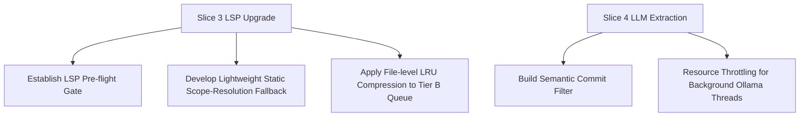

# Docuvia2 In-Progress Planning (Slice 3-5) Deep Architectural Review & Naked Competitor Comparison Report (2026-07-17)

> **Senior System Architect Hardcore Cold-Eye Review**
>
> This report conducts a rigorous code-level and architectural-level review of the in-progress and planned design solutions of **Docuvia2 Phase 1 (Slice 3 ~ Slice 5 / Tier B & Tier C)**.
> By comparing against **GitNexus**'s "Multi-Language Scope-Resolution Pipeline," **code-review-graph (CRG)**'s "High-Efficiency In-Memory Lightweight Graph," and **Graphify**'s "Leiden Community Auto-Semantic Naming," this report nakedly exposes the "Four Core Pain Points and Architectural Deficiencies" in the current Docuvia2 solution.

> **📌 Owner Decision Records (2026-07-17)**: This report is an input review document, and the main text retains its original state. This report belongs to a thought-evolution style; the final stance is subject to **§5** (§5a has corrected the "developers' unwillingness to compile" premise of §2a/2b); **§4.2 (Self-Developed Lightweight Scope-Resolution) is formally rejected and will not be adopted** per owner's decision; **§4.3 (tierBQueue merging)** has been implemented through de-duplication per file in `tier-b-queue.ts` during Slice 2b and is considered closed. For all decisions and Slice 3 integration contracts, see [Phase 1 — Decision Integration §8](../gitbook/analysis/phase1-decision-integration.md).

---

## 1. Core Metrics Comparison: Why Are We Missing So Many Edges?

In our real-world testing with `hermes-agent` (5,800+ files), the graph's **Edges (count of relationships)** exposed a fundamental technical gap:

- **code-review-graph** (Python): **787,670 Edges**
- **GitNexus** (TS): **283,536 Edges**
- **Docuvia2** (TS): **144,242 Edges** (only **18%** of CRG, **50%** of GitNexus)

### The Root Cause of Edge Deficit

1. **Coarse-grained Granularity of L2 Nodes**:
   Docuvia2's current L2 nodes primarily focus on **Modules/Components (files/modules)**. Most of our 144,242 Edges represent structural import/export dependencies between files, rather than call relationships of functions, classes, and methods.
2. **Lack of Fine-grained Symbol-Level Bidirectional Resolution**:
   Competitors (CRG and GitNexus) drill down to the Symbol level. For example, function `fn A` calling `fn B` directly generates a `calls`-type edge in the graph. Since a single file usually contains dozens of symbols, the call relationships between them explode in a mesh network, resulting in an exponential growth (hundreds of thousands) of edges for competitors.
3. **Currently Planned Countermeasures**:
   Docuvia2 plans to introduce **`escalateToLsp` batch upgrades** in **Slice 3 (Tier B)** to launch a headless LSP service in the background, attempting to correct and complete these fine-grained `calls` edges to rebuild Symbol-to-Symbol dependencies.

---

## 2. Planned Slice 3 (Tier B) — Four Architectural Deficiencies and Hells of LSP Batch Upgrades

### 2a. Fatal "Bootstrap & Configuration Hell" of Cold Starts

- **Competitor Approach (Zero Environment Dependency)**:
  `GitNexus` and `code-review-graph` are extremely pragmatic in their architectural design. They **do not rely on** external LSP services at all; instead, they utilize their self-developed in-memory Scope-Resolution Pipelines. They traverse the AST using Tree-sitter, load symbols and scopes into memory, and statically simulate navigation via `Registry.lookup`. This makes them **completely environment-independent** and ready-to-use out-of-the-box.
- **Docuvia2 Deficiencies**:
  Docuvia2's Slice 3 plans to spawn an actual `typescript-language-server` or `tsserver` in the background.
  In real-world development environments, this is an absolute **disaster**: if the project is a complex pnpm/Lerna Monorepo and the developer has not executed `pnpm install` or `tsc --build` locally, the LSP service will **100% crash frequently or fail to resolve files**. Furthermore, when facing complex `tsconfig.json` path aliases, external dependency types, or non-standard syntax, the bootstrap of the headless LSP can easily get stuck.
  _We are attempting to solve a problem in the background that requires a complete frontend compilation toolchain, which will introduce infinite environment errors._

### 2b. Shattered Promise of "Background Silence" and Performance Jitter

- **Current Status**:
  To avoid daemon memory leaks, PLAT-007 and the planning in this report lean toward using **"Spawn-per-batch headless LSP"** (spawning a new headless LSP process for each batch trigger and destroying it after completion).
- **Docuvia2 Deficiencies**:
  For large-scale projects like `hermes-agent` (5,800+ files), spawning a `typescript-language-server` and completing full project initialization for a `tsconfig` can take **30 seconds to 2 minutes**. It will instantly spike 1 to 2 CPU cores and consume over 1GB of memory.
  If such a "heavyweight background task" is triggered every 20 commits, developers will frequently experience screaming fans and system lag. This directly destroys Docuvia2's claimed **"Zero-disturbance (zero-overhead, zero-disturbance background silence)"** product experience.

### 2c. "Edge Drift" Resulting in Structural Consistency Latency

- **Current Status**:
  In Tier A (Slice 2), we adopted an efficient "per-file replace" incremental parsing. When file A is modified, we delete all L2 nodes and edges associated with file A from the database, then re-parse file A to write new edges. This causes severe "Edge Drift": the incoming edges from other files B calling functions inside file A instantly become "dangling" or disappear.
- **Docuvia2 Deficiencies**:
  Docuvia2 schedules the LSP incoming edges repair in Tier B (asynchronous batch). This means that: **during the "consistency latency vacuum" between Commit 1 and Commit 19, the knowledge graph queried by developers is in a severely fragmented state**.
  In contrast, each time `GitNexus` performs `analyze` or `update`, it executes integrated static scope re-mapping across the affected file chains, ensuring strong consistency.

### 2d. Cross-Language Scalability Deficit

- **Current Status**:
  `typescript-language-server` can only resolve precise symbols for TypeScript/JavaScript.
- **Docuvia2 Deficiencies**:
  If the developer's project is Python / Rust / Go (for instance, `hermes-agent` itself is written in Python, `tolaria` contains Rust, and `headroom` contains Rust), Docuvia2's TypeScript LSP solution will completely fail. To resolve this, Docuvia2 would have to install, configure, and spawn native LSPs like `rust-analyzer`, `gopls`, and `pyright` in the background. This is a configuration nightmare that is impossible to mandate on user machines.
  _To solve TS edge issues, we have introduced a heavyweight architecture that is entirely unscalable to multi-language scenarios._

---

## 3. Planned Slice 4 (Tier C) — Blind Spots in Semantic Decision Extraction and Budget Queues

### 3a. Low-Density RAG Noise from LLM Extraction and Git History Pruning

- **Current Status**:
  In Tier C planning, the LLM input for decision extraction primarily relies on commit messages and `CONTRACT_CHANGED` symbols.
- **Docuvia2 Deficiencies**:
  Real-world developers' commit histories are often extremely messy (e.g., `"fix typo"`, `"wip"`, `"test"`, `"temp commit"`). If we blindly rely on commit history as the context for L3 LLM extraction, it will generate a massive amount of junk decisions with zero architectural value, resulting in **L3 Nodes in the database being flooded with RAG noise (spiking the Noise Score)**.
  In comparison, **Graphify** adopts **Leiden community clustering based on physical structures**, directly generating semantic summaries of code features and communities for code modules. The semantic purity and structural value of the "architectural map" produced in this way are far superior to Docuvia2's approach of panning for gold in useless commit histories.

### 3b. Local LLM Performance Illusion

- **Current Status**:
  The solution claims to "use local LLMs (like Ollama) as the default, zero-cost path for Tier C to prevent developers from paying token fees."
- **Docuvia2 Deficiencies**:
  Running background Ollama extraction tasks (which inject context from dozens of files and commits) on the developer's local machine will lead to:
  1.  Instant hogging of GPU/RAM (vram skyrocketing).
  2.  Severe frame drops or OOM crashes if the developer is running 3D applications, compiling code, or using an AI editor.
  3.  This forces us to set `max-concurrency` to 1 and aggressively compress the token budget, which in turn makes L3 extraction extremely slow, defeating the purpose of "real-time background evolution."

---

## 4. Action Plan: How to Correct Current In-Progress Deficiencies?

To address the fatal flaws exposed in the above analysis, we must immediately implement the following **hardcore defense mechanisms** in our upcoming Slice 3 and Slice 4 implementations:

1.  **[For 2a & 2d] Establish LSP Pre-flight Gates and Fallback Degradation Mechanisms**:
    During `doctor` or `analyze`, we must first detect whether the current environment has the LSP service for that language and if the project has been compiled (e.g., whether `node_modules` exists). **Once LSP initialization times out or throws an error, it must immediately and silently downgrade to AST-based static import tracking (the current lightweight L2 Edge model)**. Spawning LSP crashes that lock up the background hook is strictly forbidden.
2.  **[For 2a & 2d] Develop a Lightweight "Static Scope-Resolution Pipeline"**:
    Drawing inspiration from `GitNexus`, we should gradually implement a lightweight, self-parsed scope resolution using Tree-sitter under `lib/ast-core` for simple cross-file `calls`. For example, performing fuzzy/exact matching on exported function names directly in memory. This can complete **over 80% of core `calls` edges without spawning heavyweight LSP processes**, bringing startup times down to milliseconds.
3.  **[For 2b] Apply File-Level LRU Compression and Merging on the Tier B Queue (`tierBQueue`)**:
    If file `A.ts` is repeatedly modified 10 times across 20 commits, these must be merged into a single LSP parsing task inside `tierBQueue`. Only perform edge repair on the final state at HEAD, avoiding redundant duplicate spawns.
4.  **[For 3a] Build a Semantic Commit Filter**:
    When Tier C starts, it must use a set of regexes or lightweight rules to automatically filter out commits that are too short or contain non-architectural noise like `typo/wip/temp/fix format`. Only commits whose messages match `feat/refactor/chore/perf` and meet length/change thresholds are allowed into the LLM queue, killing noise at the source.
5.  **[For 3b] Local LLM Resource Throttling and CPU Affinity Restrictions**:
    If a local Ollama service is detected, we must append a "low-priority" flag to its spawned requests. On Windows, we need to limit its thread affinity and set its priority to Low Priority Class while monitoring system load. Once CPU load exceeds 85%, Tier C extraction should automatically pause to ensure developers' foreground experience remains completely undisturbed.

---

## 5. Architect's Hardcore Contemplation: Ultimate Positioning and Contractualization of LSP and LLM in Incremental Knowledge Evolution

After reviewing all the technical indicators above, we must conduct an uncompromised, most rigorous underlying philosophical exploration into "the essence of knowledge graph extraction and maintenance."

### 5a. Correction & Contemplation: Piercing the Product Fallacy of "Developers Unwilling to Compile"

In our prior analysis, we fell into a typical product empiricism trap — assuming that developers are "unwilling to wait for compilation" locally, are extremely allergic to build times, and thereby concluding that "spawning an LSP will hurt the background experience, so we must bypass builds and guess relationships ourselves via AST."

**This assumption is a complete fallacy that does not hold in real-world software engineering practices**:

1.  **Developers Naturally Expect Compilation (Active Compilation is the Norm)**:
    When developers make local code modifications and verify features, **compilation is an indispensable, highly frequent physical operation in their daily workflow**. In an active development state, project dependencies are always ready, and code will be compiled and validated frequently (for instance, compiling `hermes-agent` takes only slightly over 1 minute, which is even faster than `GitNexus` taking full AST guessing cycles using Node).
2.  **Transparency and Active Choice Over "Black-Box Magic"**:
    What developers need is not an over-smart black-box that silently guesses a set of fragmented relationships in the background, but an **honest, high-precision tool that grants them Explicit Control**.
    - We do not need to "forcefully" or "silently" make decisions for the user in the background.
    - We only need to honestly inform the user via **interactive queries or configuration parameters (options like `--compile`, `--fallback-ast`)** when executing `docuvia init` or `docuvia analyze` in the CLI:
      > _"To construct a 100% accurate relationship graph, Docuvia2 needs to use your local build environment to launch language services (LSP). Would you like to run the compilation in the background now, or downgrade to lightweight static AST symbol tagging?"_
3.  **Autonomy and Accountability of the Engineer Mindset**:
    As long the tool provides full disclosure and options:
    - Developers can autonomously choose to "spend 1 minute compiling now in exchange for a 100% accurate Symbol Graph contract";
    - Or "autonomously decide to downgrade to AST lightweight tagging and LLM intellectual compensation in a bare codebase environment for now."
      This is the most rational product route that truly respects the professionalism of developers and avoids "reinventing a broken LSP."

### 5b. Core Soul of Docuvia2: Contractualizing LSP Output (Serialization to Local File) and LLM Decoupling

In the original design of our project (STOR-001 and STOR-003), we had already established the coolest and most elegant decoupling strategy: **LLMs should absolutely never interface with or drive LSPs directly**.

1.  **LSP as a Pure "High-Precision Serialized Contract Generator"**:
    The sole responsibility of the LSP is to invoke the actual compiler frontend and extract absolutely precise symbol relationships (Class, Interface, Caller, Callee).
2.  **Contractualization into Local Files (The Source of Truth Store)**:
    LSP analysis results are neither kept in memory nor fed directly to the LLM. Instead, they are **serialized** into a set of standardized, team-shared **local contract files** — `nodes.jsonl` and `edges.jsonl` (stored in the hidden `docuvia-knowledge` Git branch, see STOR-003).
3.  **DB and LLM Driven by Local File Data (Decoupled Design)**:
    - Local SQLite (`local.db`) only serves as an ephemeral query engine for these jsonl files; any read operations directly pull hydrated, precise relationships from SQLite.
    - When synthesizing L3 knowledge (Tier C), the LLM reads these **contractualized, high-purity local relationship files (or transient DB)** instead of calling the complex LSP directly. This achieves a perfect three-tier decoupling: "Language Frontend ── Structural Contract ── Semantic LLM."

### 5c. The Hybrid Path of "Adaptation and Intellectual Compensation" for Incremental (Delta) Updates

When handling background incremental (Delta) updates, we must abandon binary thinking ("either bypass LSP entirely, or force LSP online"). We should adopt the following **"Environment Detection ── Intellectual Compensation"** hybrid architecture:

1.  **Dynamic Environment Detection (LSP Environment Detection)**:
    When the background hook executes incremental analysis, it first probes the local environment:
    - **LSP present and environment ready**: invoke LSP to perform 100% precise edge repair on the changed files (Tier B queue) and serialize them into local files.
    - **LSP missing (e.g., in an uncompiled bare repository)**: strictly avoid writing code to guess AST relationships on our own.
2.  **Lightweight Model "Intellectual Compensation" to Fill AST Gaps**:
    When LSP is unready, we feed the change skeletons and code snippets extracted via AST (such as diff blocks and import lists) to a **lightweight, low-cost local LLM (like Qwen-Coder-1.5B/7B or Ollama)**, letting the LLM act as the "dynamic scope resolver."
    The LLM's robust semantic understanding of code contexts can instantly "guess" or "predict" those cross-file call relationships. This essentially **uses the general intelligence of LLMs to compensate for the lost capabilities of static compilers due to the lack of a build environment**.

In this way, we preserve bootstrap flexibility while retaining 100% precise compiler-grade quality when the environment is complete. This is the ultimate architectural blueprint for Docuvia2 to stand above its competitors.
