# Docuvia — Master System Roadmap (Implementation Standard)

> **Single Source of Truth (SSOT) for Project Phases, Architecture, & Verification**
> This document defines the engineering standard for each development phase. It includes objectives, methods, constraints, and architecture diagrams.
> Agents MUST use this document alongside `roadmap_checklist.md` to verify if the implementation matches the architectural design.

---

## Phase 1: API Server & Foundation (The Metabolism Engine)

### 🎯 Objective

Establish the core infrastructure, database models (L1/L2/L3), multi-format ingestion pipeline, Agentic RAG router, and asynchronous background metabolism to process knowledge securely.

### 🛠️ Implementation Method

- **Database:** Define entities using Drizzle ORM mapped to PostgreSQL.
- **RAG Routing:** Implement `intent-router.ts` using a 4-way classification (Direct -> Graph -> Vector -> Hybrid) prioritizing O(1) local cache.
- **Metabolism:** Run a heartbeat-driven `metabolism-tick` worker to process heavy queues (embeddings, decay, distillation) off the main thread.

### ⚠️ Precautions

- **No In-Memory State:** Avoid storing graph states in Node.js heap. Use [Database-as-IPC](../design/adrs/ADR-014-sql-indexed-graph-and-database-as-ipc.md).
- **Graceful Degradation:** The pipeline must save partial results if the LLM endpoint times out.
- **Vector Math:** Vector search must rely on [pgvector](../design/adrs/ADR-019-pgvector-migration.md), not in-memory cosine similarity (which causes OOMs at scale).

### 📁 Involved Files

- `lib/db/src/schema/*.ts` (projects, commits, l1_tags, l2_nodes, l3_nodes)
- `artifacts/api-server/src/routes/metabolism.ts`
- `lib/core/src/services/intent-router.ts`
- `lib/core/src/services/document-parser.ts`

### 🏗️ System Architecture

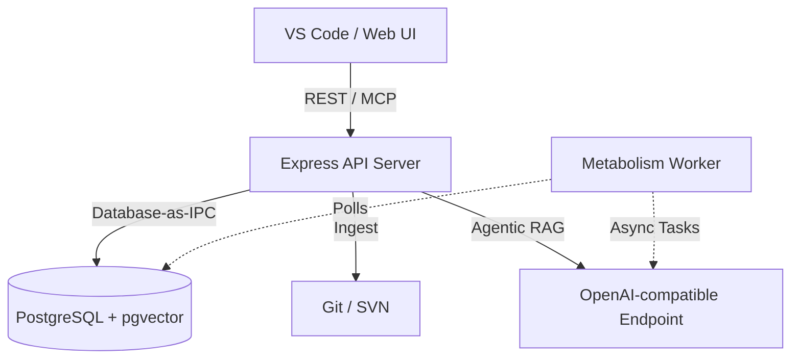

### ⚙️ Functional Operation

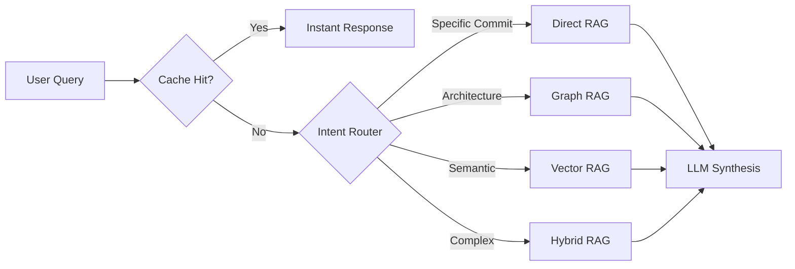

### 🗃️ Object Relationship

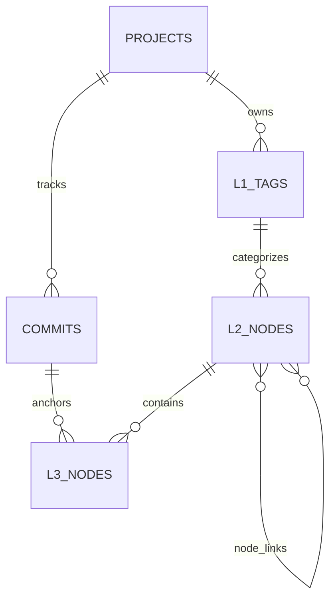

---

## Phase 2: Local-First VS Code Client & WASM AST Sync

### 🎯 Objective

Provide a standalone, offline-capable IDE extension that guarantees zero compilation friction and local-first autonomy. Utilize `web-tree-sitter` (WASM) to perform semantic AST diffs locally, slashing delta-sync overhead and removing the need for a heavy local graph database.

### 🛠️ Implementation Method

- **Smart Blast Radius (WASM):** Implement `web-tree-sitter` to parse Git diff line ranges into AST nodes. Compare old and new AST signatures to execute smart pruning (cutting off diffusion for internal statement changes).
- **Local Engine:** Create a lightweight `KnowledgeStore` (SQLite or JSON cache) for storing graph Edges to facilitate fast reverse-dependency traversal during Level 1 contract changes.
- **Outbox Pattern:** Offline L3 node creations are written to a `SyncOutbox` queue and synced to the central server only when online.
- **Zero-to-One:** Implement the `/init` onboarding flow to perform full AST extraction into the local cache.

### ⚠️ Precautions

- **Do Not Block Main Thread:** Heavy AST parsing must run in Web Workers (for VS Code) or background threads.
- **Offline Resilience:** The extension must function flawlessly without `CentralServerClient`.
- **Zero Native Build:** Do NOT use native node modules for tree-sitter to ensure cross-platform compatibility and ease of installation.

### 📁 Involved Files

- `artifacts/ast-core/src/detector/semantic-diff.ts`
- `artifacts/vscode-client/src/central-server-client.ts`
- `artifacts/vscode-client/src/knowledge-store.ts`
- `artifacts/vscode-client/src/extension.ts`

### 🏗️ System Architecture

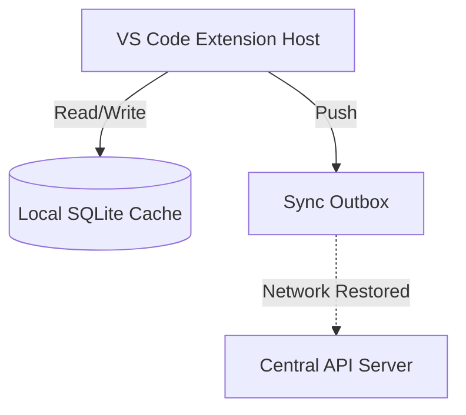

### ⚙️ Functional Operation

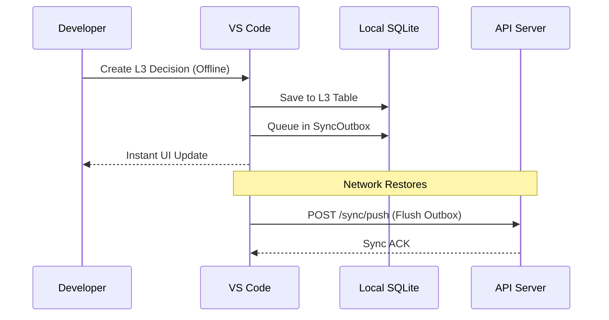

---

## Phase 3: Swarm Intelligence & Git-Isomorphic Sync

### 🎯 Objective

Align the Knowledge Graph directly with the underlying Git commit history (using Orphan branches) to enable temporal delta projections and multi-agent cross-learning (Swarm Evolution).

### 🛠️ Implementation Method

- **Orphan Branch Protocol:** Serialize knowledge graph nodes as JSON/Markdown and commit them to a hidden `docuvia-knowledge` branch to avoid polluting source code.
- **Distillation Job:** A background worker parses `correction_examples`, asks the LLM to deduce a generalized architectural rule, and saves it to `prompt_templates`.
- **Temporal Decay:** Implement `Math.exp(-LAMBDA * daysSinceVerified)` in the RAG router to naturally fade outdated knowledge.

### ⚠️ Precautions

- **Split-Brain Defense:** Synchronization must use distributed locks.
- **Git Blob Identity:** Files and commits must be anchored by their `git_blob_hash` to prevent checkout thrashing (see [ADR-016](../design/adrs/ADR-016-git-blob-native-identity-and-checkout-thrashing-defense.md)).

### 📁 Involved Files

- `lib/core/src/services/orphan-branch-writer.ts`
- `lib/db/src/schema/correction-examples.ts`
- `lib/db/src/schema/prompt-templates.ts`

### 🏗️ System Architecture

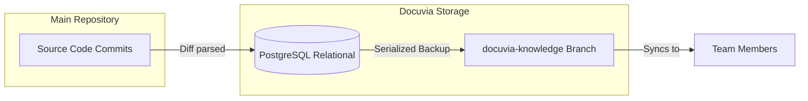

### ⚙️ Functional Operation

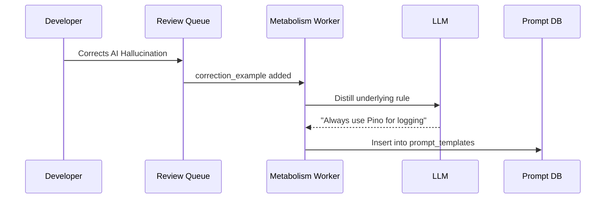

---

## Phase 4: Human-in-the-Loop & Operations (Server-Side Extensions)

### 🎯 Objective

Inject human oversight mechanisms (Review Queue), enable system portability (Exports), and integrate seamlessly with developer workflows (GitHub PRs, Slack/Teams).

### 🛠️ Implementation Method

- **Review Queue:** Expose endpoints for humans to `approve`, `reject`, or `merge` AI-generated nodes.
- **Webhooks:** Listen to `pull_request` events from GitHub, run impact analysis, and post context comments.
- **Notifications:** Implement a publish/subscribe model across projects and fire webhooks to Slack/Teams.

### ⚠️ Precautions

- **Security:** HMAC-SHA256 signature validation is mandatory for GitHub Webhooks.
- **IDOR Prevention:** Export endpoints must rigidly verify `userId` against `projectId` ownership to prevent unauthorized data dumps.

### 📁 Involved Files

- `artifacts/api-server/src/routes/review-tasks.ts`
- `artifacts/api-server/src/routes/github-webhooks.ts`
- `artifacts/api-server/src/routes/export.ts`
- `lib/core/src/services/slack-teams-client.ts`

### 🏗️ System Architecture

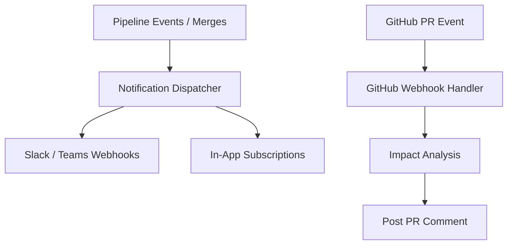

### 🗃️ Object Relationship

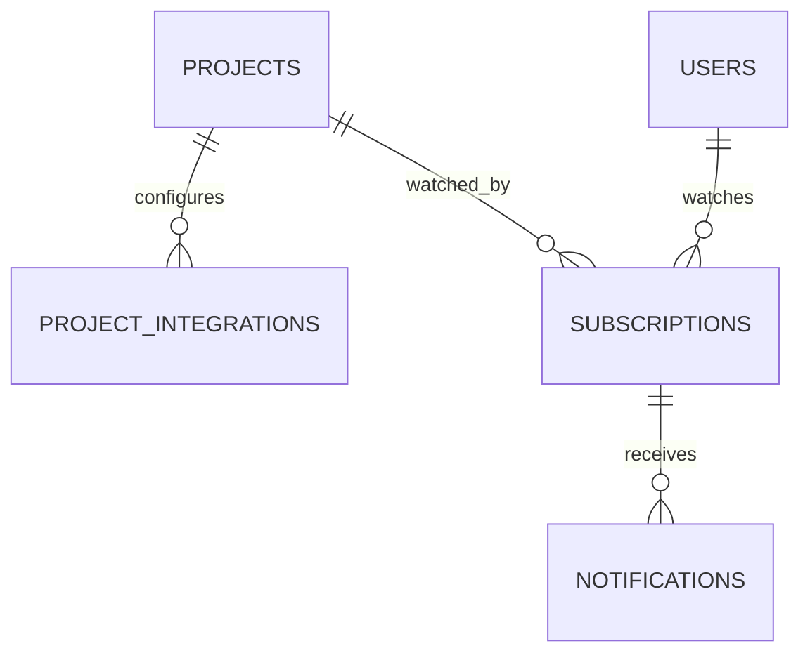

---

## Phase 5: The AST Microkernel (Deep Local Analysis)

### 🎯 Objective

Deliver zero-LLM-cost structural code analysis directly in the VS Code client by migrating away from expensive, monolithic parsers to isolated WASM Workers.

### 🛠️ Implementation Method

- **Microkernel:** Build `@workspace/ast-core` that dynamically lazy-loads `web-tree-sitter` language plugins (`.wasm`).
- **Worker Isolation:** Execute all AST parsing inside `worker_threads` (or Web Workers in VS Code) to prevent V8 main thread blocking and memory leaks.
- **Context Compression:** Replace large code snippets with compressed AST Skeletons before sending to the LLM (see [ADR-010](../design/adrs/ADR-010-context-compression-and-proxy.md)).

### ⚠️ Precautions

- **Memory Leaks:** WASM memory must be manually freed (`tree.delete()`). Failure to do so will crash the Extension Host.
- **Database-as-IPC:** Workers must write parsed graphs directly to SQLite; they must NOT serialize large JSON arrays back to the main thread (see [ADR-014](../design/adrs/ADR-014-sql-indexed-graph-and-database-as-ipc.md) and [ADR-020](../design/adrs/ADR-020-unified-isomorphic-ast-microkernel.md)).

### 📁 Involved Files

- `@workspace/ast-core` (Microkernel engine)
- `@workspace/plugin-ast-typescript` (Language plugin)
- `artifacts/api-server/src/middlewares/upload.ts` (For handling non-AST multi-modal files)
- `lib/core/src/services/ast-ingestion-pipeline.ts` (Ingestion pipeline)
- `lib/core/src/services/ast/ast-worker-pool.ts` (Worker pool + quarantine)

### 🏗️ System Architecture

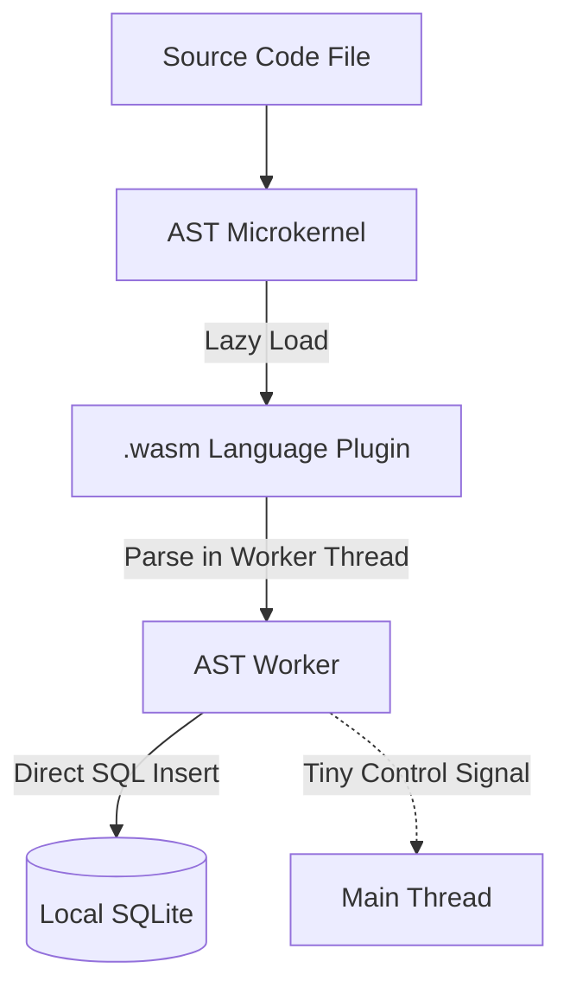

### ⚙️ Functional Operation

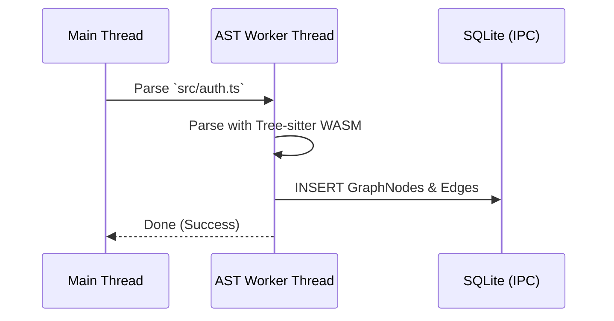

### 📋 Implementation Checklist

| Item                                                                                    | Status  | Phase   |
| :-------------------------------------------------------------------------------------- | :------ | :------ |
| Multi-language support (Python, Rust, Go, Java, C/C++, Ruby, PHP, C#)                   | ✅ Done | Phase 1 |
| Tree-sitter Query API + Scope Map + Method/Function classification                      | ✅ Done | Phase 2 |
| Knowledge Graph Ingestion (File→L2, Class/Function→L3, call/import→node_links)          | ✅ Done | Phase 3 |
| Poison Pill Quarantine (500ms timeout + AbortController)                                | ✅ Done | Phase 4 |
| **Batch Write Optimization** — Streaming chunked batch INSERTs for large `.jsonl` files | ✅ Done | Phase 4 |
| **Incremental Fast-Path** — `git diff-tree -M` for O(1) delta detection                 | ✅ Done | Phase 4 |
| **Cross-Language Edges** — API contracts, framework-specific AST tracking               | ✅ Done | Phase 4 |
| **Zero-Server Deep Traversal** — Pure local SQLite graph queries                        | ✅ Done | Phase 5 |
| **Local Context Compression** — Token reduction pipeline before LLM                     | ✅ Done | Phase 5 |
| **Sub-second Incremental Watch** — Fast-path AST updates on file save                   | ✅ Done | Phase 5 |
| **Git Hook Integration (`post-commit`)** — Non-intrusive local AST extraction           | ✅ Done | Phase 5 |
| **Agent AI Hook (`init-agent`)** — Broad platform support (Claude/Cursor/Copilot)       | ✅ Done | Phase 5 |

---

## Phase 6: Architecture Hardening & Stabilization (The Tech Debt Phase)

### 🎯 Objective

Remediate critical flaws discovered during adversarial audits (OOM risks, IDOR vulnerabilities, race conditions) to secure the platform for production scaling.

### 🛠️ Implementation Method

- **pgvector Migration:** Alter Drizzle schemas to use `vector(1536)` and rewrite `intent-router.ts` to execute cosine similarity at the database level using IVFFlat/HNSW indexes.
- **Concurrency Locks:** Replace the local boolean `let isMetabolismRunning` with a robust PostgreSQL `FOR UPDATE SKIP LOCKED` transaction.
- **Security Hardening:** Inject strict `req.user.id === project.ownerId` middleware checks into `/export` and related routes.

### ⚠️ Precautions

- **Data Migration:** Migrating from JSONB to `pgvector` requires a careful database migration script to avoid locking the production database for extended periods.
- **SVN Parity:** SVN clients must be updated to store diffs correctly in the dedicated `diff` column instead of stuffing them into the commit message field, matching the Git implementation behavior (currently marked as Pending).

### 📁 Involved Files

- `artifacts/api-server/src/routes/export.ts`
- `artifacts/api-server/src/routes/github-webhooks.ts`
- `artifacts/api-server/src/routes/metabolism.ts`
- `lib/core/src/services/intent-router.ts`
- `lib/core/src/services/svn-client.ts`

### 🏗️ System Architecture

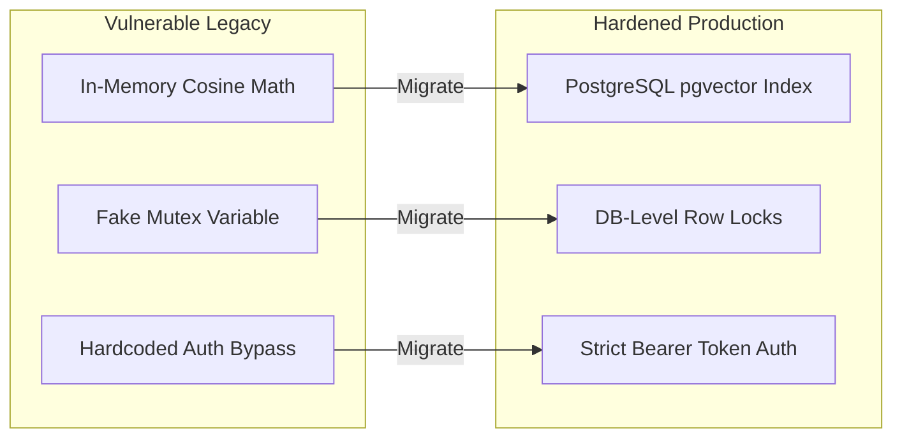
