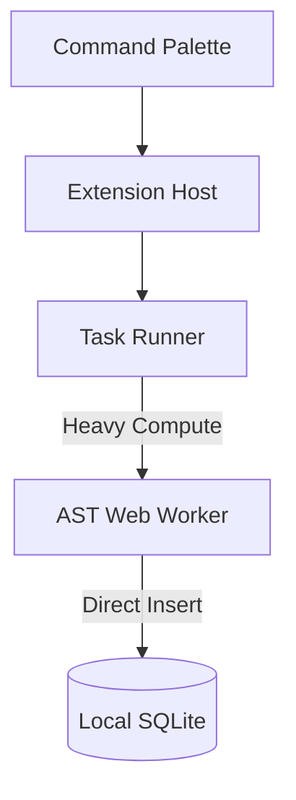
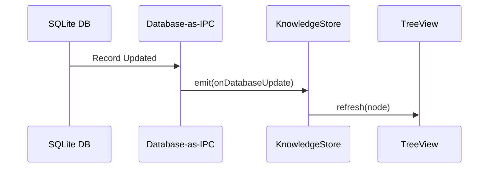

# VS Code Client — Implementation Roadmap

> **Single Source of Truth (SSOT) for the VS Code Extension**
> This document follows the exact same format as `master-roadmap.md` but focuses entirely on the `@workspace/vscode-client` package. It defines the implementation standards for the IDE integration.

---

## Phase 1: Core Scaffolding & Command Palette

### 🎯 Objective

Establish the foundational command infrastructure in VS Code, allowing users to initialize their workspace and interact with the local graph without blocking the editor.

### 🛠️ Implementation Method

- **Command Registration:** Register globally available commands in `extension.ts` (e.g., `docuvia.initProject`, `docuvia.addDecision`).
- **Initialization:** The `/init` flow creates the SQLite DB ([Database-as-IPC](../design/adrs/ADR-014-sql-indexed-graph-and-database-as-ipc.md)) and spins up the AST Worker ([WASM Microkernel](../design/adrs/ADR-020-unified-isomorphic-ast-microkernel.md)).
- **Outbox Queue:** `docuvia.addDecision` writes payloads directly to the local DB and the `SyncOutbox`.

### ⚠️ Precautions

- **No Direct YAML Writes:** Data must be written to SQLite, avoiding the deprecated `.docuvia` YAML configs ([ADR-002](../design/adrs/ADR-002-local-first-architecture.md)).
- **Non-blocking UI:** Commands like extraction must not freeze the editor. Heavy lifting is dispatched to the background via [Asynchronous Metabolism](../design/adrs/ADR-008-asynchronous-metabolism.md).

### 📁 Involved Files

- `artifacts/vscode-client/src/extension.ts`
- `artifacts/vscode-client/src/TaskRunner.ts`
- `artifacts/vscode-client/src/CentralServerClient.ts`

### 🏗️ System Architecture

---

## Phase 2: Reactivity & Knowledge Graph View

### 🎯 Objective

Provide a hierarchical, multi-root visualization of the `L1 -> L2 -> L3` knowledge abstraction without manually parsing the file system.

### 🛠️ Implementation Method

- **Tree Provider:** `KnowledgeGraphTreeProvider` reads from the local SQLite database.
- **Reactivity:** Replaces `vscode.FileSystemWatcher` with native database events (IPC Control Signals) emitted by the AST worker to trigger `store.onDidLoad`.
- **Contextual Nodes:** Display uninitialized projects as stub nodes with an inline `Init` action.

### ⚠️ Precautions

- **Avoid Thrashing:** Ensure UI repaints only occur for the specific workspace folder whose DB updated, preventing full tree rebuilds on a single file save.
- **Legacy Abstraction:** Follow the strict three-tier [Knowledge Abstraction Strategy](../design/adrs/ADR-005-knowledge-abstraction-strategy.md).

### 📁 Involved Files

- `artifacts/vscode-client/src/KnowledgeStore.ts`
- `artifacts/vscode-client/src/KnowledgeGraphTreeProvider.ts`

### ⚙️ Functional Operation

---

## Phase 3: Editor Integration (Hover & CodeLens)

### 🎯 Objective

Inject contextual knowledge directly into the code editing experience unobtrusively, providing explanations and semantic anchors.

### 🛠️ Implementation Method

- **Virtual Documents:** Clickable CodeLens actions fetch the decision markdown from SQLite and open it via a virtual text document provider, not a physical `.md` file.
- **Progressive Enrichment:** Use the AST Microkernel to identify symbols for Hover popups instead of brittle UUID regex matching ([ADR-015](../design/adrs/ADR-015-progressive-enrichment-and-ast-lsp-dual-engine.md)).

### ⚠️ Precautions

- **Trusted Markdown:** Ensure Hover `MarkdownString` properties have `isTrusted: { enabledCommands: [...] }` set, otherwise command links will be silently stripped by VS Code.
- **Performance (Main Thread Protection):** CodeLens and Hover providers must be debounced and restricted to the visible viewport. A synchronous SQLite query scanning a 10,000-line file will freeze the extension host. Must respond in less than 50ms.

### 📁 Involved Files

- `artifacts/vscode-client/src/DocuviaCodeLensProvider.ts`
- `artifacts/vscode-client/src/DocuviaHoverProvider.ts`

---

## Phase 4: Chat Participant & Webviews

### 🎯 Objective

Provide conversational interaction via Copilot Chat and rich cross-project search results visualization.

### 🛠️ Implementation Method

- **Chat Participant (`@docuvia`):** Register slash commands (`/explore`, `/query`, `/extract`). Connect `/query` to the local [Agentic RAG Router](../design/adrs/ADR-007-agentic-rag-routing.md).
- **Webviews:** Build `SearchResultsPanel` and `DashboardPanel` using VS Code's Webview API. Map click events (`openDecision`) to the local SQLite `nodeId`.

### ⚠️ Precautions

- **Content Security Policy (CSP):** Webviews must implement strict nonce-based CSPs to execute scripts safely.
- **Path Traversal Security:** Since files are no longer read from disk (replaced by [Database-as-IPC](../design/adrs/ADR-014-sql-indexed-graph-and-database-as-ipc.md)), raw `filePath` payloads are deprecated in favor of `nodeId` lookups.

### 📁 Involved Files

- `artifacts/vscode-client/src/ChatParticipant.ts`
- `artifacts/vscode-client/src/SearchResultsPanel.ts`
- `artifacts/vscode-client/src/DashboardPanel.ts`
