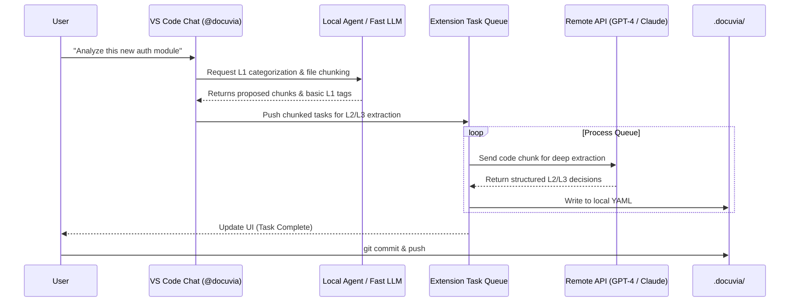
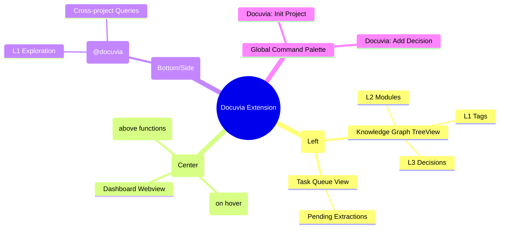

# VS Code Extension Implementation Roadmap (Git-Backed Architecture)

## Architecture Paradigm Shift

Based on architectural discussions, the VS Code Extension will adopt a **Git-backed, Local-first** architecture with a **Hybrid Execution Engine**.

### Core Principles
1. **Source of Truth**: The local `.docuvia/` folder inside each Git repository is the absolute source of truth for deep project knowledge.
2. **Conflict Resolution**: Handled entirely by Git (merges, rebases).
3. **Central Server Role**: The PostgreSQL Docuvia Server transitions to a **Global Search Index** for cross-project "breadth" knowledge, updated via CI/CD pipelines.
4. **Hybrid Execution**: Light tasks (file reading, simple routing, L1 exploration) run locally (via local LLMs like Qwen 0.5B or fast API). Heavy tasks (L2/L3 extraction) are queued and processed asynchronously.

---

## Roadmap

### Phase 1: Local Knowledge Schema & Foundations
* **Goal**: Define how knowledge is stored locally and create the basic extension skeleton.
* **Tasks**:
  * [ ] Initialize VS Code Extension project structure (`artifacts/vscode-client`).
  * [ ] Define the `.docuvia` local file schema (e.g., `l1_tags.yaml`, `l2_modules.yaml`, `l3_decisions/`).
    * *Decision*: Use UUIDs/CUIDs for strict entity linking, paired with human-readable fields (`slug` or `name`) for Git diff readability.
    * *Decision*: Structure L3 decisions as Markdown files with YAML frontmatter.
    * *Decision*: Implement an L3 Router/Index (`l3_index.yaml`) to map UUIDs to their corresponding markdown files, preventing costly full-directory scans.
  * [ ] Implement local file system watchers and parsers to load `.docuvia` data into VS Code memory.
  * [ ] Create the `~/.docuvia/config.yaml` schema for global settings (API keys, Central Server URL).

### Phase 2: UI/UX Shell & TreeViews
* **Goal**: Build the native VS Code interfaces to display local knowledge.
* **Tasks**:
  * [ ] Register Docuvia Activity Bar Icon.
  * [ ] Implement `Knowledge Graph` TreeView (L1 -> L2 -> L3 hierarchy) reading from local `.docuvia`.
  * [ ] Implement `Task Queue` TreeView for tracking background extraction tasks.
  * [ ] Create the Webview-based Dashboard skeleton (to replace the web app).
    * *Decision*: The Dashboard serves as a **"Project Knowledge Hub"**.
    * *Decision*: **Layout**: Split layout.
      * **Left Pane (Actionable & High-Value Knowledge)**: Quick Start guides, most frequently accessed decisions, highly-tagged modules, and an overview of "What is this repo?".
      * **Right Pane (Stats & Background Tasks, smaller UI)**: Knowledge coverage statistics, background extraction queues, recent architectural changes.
      * **Bottom**: A unified search/Agent bar for natural language queries (both deep local context and broad central search).

### Phase 3: Interactive Exploration & Hybrid Execution (Chat)
* **Goal**: Implement the `@docuvia` chat participant and local/remote execution routing.
* **Tasks**:
  * [ ] Register `@docuvia` Chat Participant.
  * [ ] Implement "L1 Exploration Mode" using local/fast LLMs to analyze `README.md` and suggest initial architecture.
    * *Decision*: Use a **Multi-Template-Driven** approach for L1 initialization. Extension detects project type (e.g., hybrid, frontend, backend) and offers multiple predefined templates (Standard Ontology).
    * *Decision*: Fallback to Interactive Chat if the project type is unrecognized. The resulting custom L1 tags from the chat session can be synchronized back to the Central Server to expand the global ontology.
  * [ ] Implement the Task Queue manager to chunk heavy L2/L3 extraction requests.

### Phase 4: Editor Integration (Deep Context)
* **Goal**: Bring knowledge directly into the code editing experience.
* **Tasks**:
  * [ ] Implement CodeLens: Provide "View Context" or "Add Decision" buttons above key architectural boundaries.
    * *Decision*: Use **CodeLens as the primary knowledge signal** (e.g., `🧠 Docuvia: 2 Decisions`) to avoid cluttering native Hover tooltips.
    * *Decision*: Clicking the CodeLens shows the 1-2 most highly relevant decisions directly in a Peek View or Quick Pick. If there are more decisions or complex context, route the user to the Chat View for interactive analysis, modification, or explanation.
  * [ ] Implement Hover Provider: Show L3 decisions when hovering over relevant functions/modules (restrict to explicit requests or Docuvia files to avoid noise).
  * [ ] Implement context-menu action to quickly generate an L3 decision draft from selected code and save to `.docuvia/`.

### Phase 5: Breadth Search Integration (Central Server)
* **Goal**: Connect the local extension to the central Docuvia server for cross-project queries.
* **Tasks**:
  * [ ] Update Chat participant to route "breadth" queries (e.g., "How do other projects do auth?") to the central `/query` API.
  * [ ] Display remote search results seamlessly within the Chat or a dedicated Webview search panel.

---

## Functional Component Mapping

The following Mermaid diagrams illustrate the system interactions.

### 1. Storage & Synchronization Flow
How data moves between Local Git, VS Code, and the Central Server.

```mermaid
flowchart TD
    subgraph VSCode_Extension["VS Code Extension"]
        Editor[Editor / Hover]
        Chat[Chat View]
        Tree[Sidebar TreeView]
        LocalLogic[Local Extension Logic]
    end

    subgraph Local_Workspace["Local Git Workspace"]
        Code[Source Code]
        DocuviaFolder[".docuvia/ (YAMLs)"]
    end
    
    subgraph Global_Settings["Global (Local Machine)"]
        UserConfig["~/.docuvia/config.yaml"]
    end

    subgraph Remote_Infrastructure["Remote Infrastructure"]
        GitRemote[GitHub / GitLab]
        CICD[CI/CD Pipeline]
        CentralDB[(PostgreSQL Central Index)]
        DocuviaAPI[Docuvia Server API]
    end

    Editor & Chat & Tree <--> LocalLogic
    LocalLogic <-->|Read/Write| DocuviaFolder
    LocalLogic -->|Read| UserConfig
    Code <--> DocuviaFolder : "Tied by Git Commits"
    
    DocuviaFolder -->|git push| GitRemote
    GitRemote -->|Trigger| CICD
    CICD -->|Index Updates| DocuviaAPI
    DocuviaAPI -->|Write| CentralDB
    
    LocalLogic <-->|Query Breadth Knowledge| DocuviaAPI
```

### 2. Hybrid Execution & Task Flow
How tasks are split between local lightweight models and heavy remote processing.



### 3. VS Code UI Layout
How the extension maps to VS Code native UI elements.


